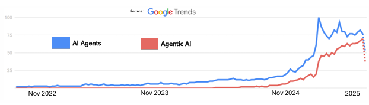
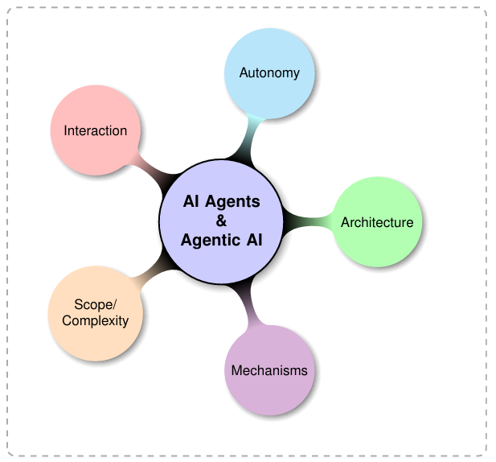

Original Source (原文地址):  https://arxiv.org/pdf/2505.10468

## Title and authors（标题与作者）

**English**  
> AI Agents vs. Agentic AI: A Conceptual Taxonomy, Applications and Challenges  
>   
> Ranjan Sapkota ** , Konstantinos I. Roumeliotist, Manoj Karkee **  
>   
> *Cornell University, Department of Biological and Environmental Engineering, USA  
> University of the Peloponnese, Department of Informatics and Telecommunications, Tripoli, Greece  
>   
> #Corresponding authors: rs2672@cornell.edu, mk2684@cornell.edu  
>   
> arXiv:2505.10468v4 [cs.AI] 28 May 2025

**中文**  
> AI 代理与 Agentic AI：概念分类、应用与挑战  
>   
> Ranjan Sapkota**，Konstantinos I. Roumeliotis，Manoj Karkee**  
>   
> *康奈尔大学，美国，生物与环境工程系  
> 伯罗奔尼撒大学，希腊特里波利，信息与电信系  
>   
> #通讯作者：rs2672@cornell.edu，mk2684@cornell.edu  
>   
> arXiv:2505.10468v4 [cs.AI] 2025 年 5 月 28 日

---

## Abstract（摘要）

**English**  
> Abstract-This review critically distinguishes between AI  
> Agents and Agentic AI, offering a structured, conceptual tax-  
> onomy, application mapping, and analysis of opportunities and  
> challenges to clarify their divergent design philosophies and  
> capabilities. We begin by outlining the search strategy and  
> foundational definitions, characterizing AI Agents as modular  
> systems driven and enabled by LLMs and LIMs for task-  
> specific automation. Generative AI is positioned as a precursor  
> providing the foundation, with AI agents advancing through tool  
> integration, prompt engineering, and reasoning enhancements.  
> We then characterize Agentic AI systems, which, in contrast to  
> AI Agents, represent a paradigm shift marked by multi-agent  
> collaboration, dynamic task decomposition, persistent memory,  
> and coordinated autonomy. Through a chronological evaluation  
> of architectural evolution, operational mechanisms, interaction  
> styles, and autonomy levels, we present a comparative analysis  
> across both AI agents and agentic AI paradigms. Application do-  
> mains enabled by AI Agents such as customer support, schedul-  
> ing, and data summarization are then contrasted with Agentic AI  
> deployments in research automation, robotic coordination, and  
> medical decision support. We further examine unique challenges  
> in each paradigm including hallucination, brittleness, emergent  
> behavior, and coordination failure, and propose targeted solutions  
> such as ReAct loops, retrieval-augmented generation (RAG),  
> automation coordination layers, and causal modeling. This work  
> aims to provide a roadmap for developing robust, scalable, and  
> explainable AI-driven systems.

**中文**  
> 摘要——本综述对 AI Agents 与 Agentic AI 进行了批判性区分，提供结构化的概念分类、应用映射，以及机遇与挑战分析，以澄清二者在设计理念与能力上的差异。我们首先概述检索策略与基础定义，将 AI Agents 界定为由 LLM 与 LIM 驱动并赋能的模块化系统，用于特定任务自动化。生成式 AI 被定位为提供基础的前驱；在此之上，AI Agents 通过工具集成、提示工程与推理增强不断发展。随后，我们刻画 Agentic AI 系统：与 AI Agents 相比，它体现为一种范式转变，标志为多智能体协作、动态任务分解、持久化记忆与协调自治。通过对架构演进、运行机制、交互风格与自治水平的时间序列评估，我们对两种范式进行了比较分析。继而，对 AI Agents 支持的应用领域（如客户支持、日程安排、数据摘要）与 Agentic AI 的落地场景（如科研自动化、机器人协同、医疗决策支持）进行对照。我们进一步审视各自的独特挑战，包括幻觉、脆弱性、涌现行为与协调失败，并提出针对性方案，如 ReAct 循环、检索增强生成（RAG）、自动化协调层与因果建模。本研究旨在为开发稳健、可扩展、可解释的 AI 驱动系统提供路线图。

---

## Index Terms（索引词）

**English**  
> Index Terms-AI Agents, Agentic AI, Autonomy, Reasoning,  
> Context Awareness, Multi-Agent Systems, Conceptual Taxonomy,  
> Vision-Language Models

**中文**  
> 索引词——AI Agents，Agentic AI，自主性，推理，上下文感知，多智能体系统，概念分类，视觉-语言模型

---

## [Figure 1: Global Google search trends showing rising interest in "AI Agents" and "Agentic AI" since November 2022 when the ChatGPT was first introduced.]  
[图 1：自 2022 年 11 月（ChatGPT 首次推出）以来，“AI Agents”和“Agentic AI”的全球 Google 搜索趋势上升。]

---

## I. INTRODUCTION（引言）

**English**  
> Prior to the widespread adoption of AI Agents and Agentic  
> AI around 2022 (Before ChatGPT was introduced), the de-  
> velopment of autonomous and intelligent agents was deeply  
> rooted in foundational paradigms of artificial intelligence,  
> particularly multi-agent systems (MAS) and expert systems,  
> which emphasized social action and distributed intelligence  
> [1], [2]. Notably, Castelfranchi [3] laid the critical ground-  
> work by introducing ontological categories for social action,  
> structure, and mind, arguing that sociality emerges from in-  
> dividual agents' actions and cognitive processes in a shared  
> environment, with concepts like goal delegation and adoption  
> forming the basis for cooperation and organizational behavior.  
> Similarly, Ferber [4] provided a comprehensive framework for  
> MAS, defining agents as entities with autonomy, perception,  
> and communication capabilities, and highlighting their appli-  
> cations in distributed problem-solving, collaborative robotics,  
> and synthetic world simulations.

**中文**  
> 在 2022 年前后（ChatGPT 推出之前）AI Agents 与 Agentic AI 尚未广泛采用之际，自主与智能体的研究深深扎根于人工智能的基础范式之中，  
> 尤其是多智能体系统（MAS）与专家系统，它们强调社会行为与分布式智能[1]，[2]。值得注意的是，Castelfranchi[3] 通过引入社会行为、结构与心智的本体范畴奠定了关键基础，提出社会性源自共享环境中个体智能体的行动与认知过程，目标委派与采纳等概念构成合作与组织行为的根基。类似地，Ferber[4] 为 MAS 提供了全面的框架，将智能体定义为具备自主、感知与通信能力的实体，并强调其在分布式问题求解、协作机器人与合成世界仿真中的应用。

---

**English**  
> These early studies established that individual social actions  
> and cognitive architectures are fundamental to modeling col-  
> lective phenomena, setting the stage for modern AI Agents.  
> This paper builds on these foundational concepts to explore  
> how social action modeling, as proposed in [3], [4], informs  
> the design of AI Agents capable of complex, socially intelli-  
> gent interactions in dynamic environments.

**中文**  
> 这些早期研究确立了：个体的社会行为与认知架构是刻画群体现象的基础，为现代 AI Agents 奠定了舞台。本文基于这些基础概念，探讨[3]、[4] 所提出的社会行为建模如何指导 AI Agents 的设计，使其能够在动态环境中进行复杂且具社会智能的交互。

---

**English**  
> Classical Agent-like systems were designed to perform  
> specific tasks with predefined rules, which offered limited  
> autonomy, and minimal adaptability to dynamic environments.  
> These systems were primarily reactive or deliberative, relying  
> on symbolic reasoning, rule-based logic, or scripted behaviors  
> rather than the learning-driven, context-aware capabilities of  
> modern AI Agents [5], [6]. For instance, expert systems used  
> knowledge bases and inference engines to emulate human  
> decision-making in domains like medical diagnosis (e.g.,  
> MYCIN [7]). Other notable examples include DENDRAL [8],  
> an expert system for molecular structure prediction; XCON  
> [9], used for computer system configuration; and CLIPS [10], a  
> rule-based production system framework. Systems like SOAR  
> [11] and the subsumption architecture [12] extended symbolic  
> and reactive logic into cognitive modeling and robotics.

**中文**  
> 经典的类智能体系统以预定义规则执行特定任务，自主性有限，对动态环境的适应性也很弱。这类系统主要是反应式或审议式，依赖符号推理、基于规则的逻辑或脚本化行为，而非现代 AI Agents 所具备的学习驱动与上下文感知能力[5]，[6]。例如，专家系统通过知识库与推理引擎在医疗诊断（如 MYCIN[7]）等领域模拟人类决策。其他典型例子包括 DENDRAL[8]（分子结构预测专家系统）、XCON[9]（计算机系统配置）、以及基于规则的生产系统框架 CLIPS[10]。SOAR[11] 与分层抑制架构（subsumption architecture）[12] 则将符号与反应式逻辑扩展到认知建模与机器人领域。

---

**English**  
> In addition to task-specific reasoning, these agents sup-  
> ported limited forms of social interaction. Early conversational  
> systems like ELIZA [13] and PARRY [14] simulated basic  
> dialogue through pattern matching and script-based responses  
> but lacked genuine understanding or contextual adaptation.  
> Similarly, reactive agents in robotics executed sense-act cycles  
> based on fixed control rules, as seen in early autonomous  
> platforms like the Stanford Cart [15].

**中文**  
> 除了面向任务的推理之外，这些智能体对社会性交互的支持十分有限。早期会话系统如 ELIZA[13] 与 PARRY[14] 通过模式匹配与脚本式响应来模拟基础对话，但缺乏真正的理解或上下文适应。同样，在机器人领域，反应式智能体基于固定控制规则执行“感知—动作”循环，典型如早期的自主平台 Stanford Cart[15]。

---

**English**  
> Multi-agent systems facilitated coordination among dis-  
> tributed entities, exemplified by auction-based resource allo-  
> cation in supply chain management [16], [17]. Scripted AI  
> in video games, like NPC behaviors in early RPGs, used  
> predefined decision trees [18]. Furthermore, BDI (Belief-  
> Desire-Intention) architectures enabled goal-directed behavior  
> in software agents, such as those in air traffic control simula-  
> tions [19], [20].

**中文**  
> 多智能体系统促进了分布式实体之间的协调，例如在供应链管理中通过拍卖机制进行资源分配[16]，[17]。电子游戏中的脚本式 AI（如早期 RPG 的 NPC 行为）采用预定义的决策树[18]。此外，BDI（信念—愿望—意图）架构使软件智能体能够实施目标导向的行为，如空中交通管制仿真中的智能体[19]，[20]。

---

**English**  
> However, across these diverse systems, early AI agents  
> shared common limitations: they lacked self-learning, gen-  
> erative reasoning, and adaptability to unstructured or evolv-  
> ing environments. These shortcomings distinguish them from  
> Agentic AI a recent paradigm that builds on deep learning, re-  
> inforcement learning, and foundation models to enable agents  
> with contextual awareness, continuous learning, and emergent  
> autonomy [21].

**中文**  
> 然而，尽管系统形态多样，早期 AI 智能体具有共同局限：缺乏自学习、生成式推理，以及对非结构化或演化环境的适应能力。这些短板将其与 Agentic AI 区分开来——后者是一种较新的范式，构建于深度学习、强化学习与基础模型之上，使智能体具备上下文感知、持续学习与涌现式自治能力[21]。

---

**English**  
> Recent public, academic and industry interest in AI Agents  
> and Agentic AI reflects this broader transition in system  
> capabilities. As illustrated in Figure 1, Google Trends data  
> demonstrates a significant rise in global search for both terms  
> following the emergence of large-scale generative models in  
> late 2022. This shift is closely tied to the evolution of agent  
> design from the pre-2022 era, where AI Agents operated  
> in constrained, rule-based environments, to the post-LLM  
> period marked by learning-driven, flexible/adaptive architec-  
> tures [22]-[24]. These newer systems enable agents to refine  
> their performance over time and interact autonomously with  
> unstructured, dynamic inputs [25]-[27]. For instance, while  
> pre-modern expert systems required manual updates to static  
> knowledge bases, modern agents leverage emergent neural  
> architectures to generalize across tasks [24]. The surge in  
> trend activity reflects growing awareness of this technological  
> leap, as researchers and practitioners seek tools that go beyond  
> automation toward autonomy and general-purpose reasoning.  
> Moreover, applications are no longer confined to narrow  
> domains like simulations or logistics, but now extend to broad  
> practical settings demanding real-time reasoning and adaptive  
> control. This momentum, as visualized in Figure 1, highlights  
> the significance of recent architectural advances in scaling  
> autonomous agents for real-world deployment.

**中文**  
> 近期公众、学术界与产业界对 AI Agents 与 Agentic AI 的兴趣，反映了系统能力的整体迁移。如图 1 所示，自 2022 年末大规模生成模型涌现以来，这两个术语的全球搜索量显著上升。此转变紧密关联于智能体设计的演进：从 2022 年前受限于规则的环境，迈向 LLM 之后以学习驱动、灵活/自适应为特征的架构[22]-[24]。这些新系统使智能体能够随时间精进表现，并在非结构化、动态输入下实现自主交互[25]-[27]。例如，前现代专家系统需要对静态知识库进行人工更新，而现代智能体可借助涌现的神经架构在任务间泛化[24]。趋势激增反映出人们对技术飞跃的认知提升，研究者与实践者正寻求超越自动化、迈向自治与通用推理的工具。此外，应用不再局限于模拟或物流等狭窄领域，而是扩展至需要实时推理与自适应控制的广泛场景。这一势头（见图 1）凸显了近期架构进步在将自主智能体规模化部署于现实世界中的重要意义。

---

**English**  
> The release of ChatGPT in November 2022 marked a pivotal  
> inflection point in the development and public perception of  
> artificial intelligence, catalyzing a global surge in adoption,  
> investment, and research activity [28]. In the wake of this  
> breakthrough, the AI landscape underwent a rapid transforma-  
> tion, shifting from the use of standalone LLMs toward more  
> autonomous, task-oriented frameworks [29]. This evolution  
> progressed through two major post-generative phases: AI  
> Agents and Agentic AI. Initially, the widespread success of  
> ChatGPT popularized Generative Agents, which are LLM-  
> based systems designed to produce novel outputs such as text,  
> images, and code from user prompts [30], [31]. These agents  
> were quickly adopted across applications ranging from con-  
> versational assistants (e.g., GitHub Copilot [32]) and content-  
> generation platforms (e.g., Jasper [33]) to creative tools (e.g.,  
> Midjourney [34]), revolutionizing domains like digital design,  
>   
> marketing, and software prototyping throughout 2023 and  
> beyond.

**中文**  
> 2022 年 11 月 ChatGPT 的发布成为人工智能发展与公众认知的关键拐点，催化了全球范围的采用、投资与研究热潮[28]。在这一突破之后，AI 版图迅速转型：从单体 LLM 的使用转向更具自治性、面向任务的框架[29]。这一演进经历了两个后生成式阶段：AI Agents 与 Agentic AI。起初，ChatGPT 的广泛成功普及了“生成式智能体”（Generative Agents）——基于 LLM 的系统，可根据用户提示生成文本、图像与代码等新输出[30]，[31]。这类智能体迅速被应用于对话助理（如 GitHub Copilot[32]）、内容生成平台（如 Jasper[33]）与创作工具（如 Midjourney[34]），在 2023 年及之后重塑了数字设计、  
>   
> 营销与软件原型等领域。

---

**English**  
> Although the term AI Agent was first introduced in 1998  
> [3], it has since evolved significantly with the rise of generative  
> AI. Building upon this generative foundation, a new class of  
> systems commonly referred to as AI Agents has emerged.  
> These agents enhanced LLMs with capabilities for external  
> tool use (e.g., API-based tools), function calling, and sequen-  
> tial reasoning, enabling them to retrieve real-time information  
> and execute multi-step workflows autonomously [35], [36].  
> Example frameworks such as AutoGPT [37] and BabyAGI  
> (https://github.com/yoheinakajima/babyagi) highlight this tran-  
> sition, showcasing how LLMs could be embedded within  
> feedback loops to dynamically plan, act, and adapt in goal-  
> driven environments [38], [39]. By late 2023, the field had  
> advanced further into the realm of Agentic AI complex, multi-  
> agent systems in which specialized agents collaboratively  
> decompose goals, communicate, and coordinate toward shared  
> objectives. In line with this evolution, Google introduced the  
> Agent-to-Agent (A2A) protocol in 2025 [40], a proposed  
> standard designed to enable seamless interoperability among  
> agents across different frameworks and vendors. The protocol  
> is built around five core principles: embracing agentic capabil-  
> ities, building on existing standards, securing interactions by  
> default, supporting long-running tasks, and ensuring modality  
> agnosticism. These guidelines aim to lay the groundwork for  
> a responsive, scalable agentic infrastructure.

**中文**  
> 尽管“AI Agent”一词最早于 1998 年提出[3]，但随着生成式 AI 的兴起，其内涵已发生显著演化。以生成式能力为基础，一类通常被称为 AI Agents 的系统出现了。这些智能体为 LLM 增配了外部工具使用（如基于 API 的工具）、函数调用与序列化推理等能力，使其能够自主检索实时信息并执行多步工作流[35]，[36]。AutoGPT[37] 与 BabyAGI（https://github.com/yoheinakajima/babyagi）等框架凸显了这一转变，展示了如何将 LLM 嵌入反馈回路，以在目标驱动环境中动态规划、行动与适应[38]，[39]。至 2023 年末，领域进一步迈入 Agentic AI：复杂的多智能体系统中，专门化智能体协同分解目标、通信与协调以达成共同任务。顺应这一演进，Google 于 2025 年提出 Agent-to-Agent（A2A）协议[40]——该标准旨在实现跨不同框架与厂商的智能体无缝互操作。该协议围绕五个核心原则构建：拥抱智能体能力、基于既有标准、默认安全交互、支持长时任务与保持模态无关性。这些原则旨在为响应式、可扩展的 agentic 基础设施奠定基石。

---

**English**  
> Architectures such as CrewAI demonstrate how these agen-  
> tic frameworks can accomplish decision-making across dis-  
> tributed roles, facilitating intelligent behavior in high-stake  
> applications including robotics, logistics management, and  
> adaptive decision-support [41]-[44].

**中文**  
> CrewAI 等架构展示了此类 agentic 框架如何在分布式角色间完成决策，从而在机器人、物流管理与自适应决策支持等高风险应用中实现智能行为[41]-[44]。

---

**English**  
> As the field progresses from Generative Agents toward  
> increasingly autonomous systems of Agentic AI , it becomes  
> critically important to delineate the technological and concep-  
> tual boundaries between AI Agents and Agentic AI. While  
> both paradigms build upon LLMs and extend the capabilities  
> of generative systems, they embody fundamentally different  
> architectures, interaction models, and levels of autonomy. AI  
> Agents are typically designed as single-entity systems that  
> perform goal-directed tasks by utilizing external tools, apply-  
> ing sequential reasoning, and integrating real-time information  
> to complete well-defined functions [24], [45]. In contrast,  
> Agentic AI systems are composed of multiple, specialized  
> agents that coordinate, communicate, and dynamically allocate  
> sub-tasks within a broader workflow to achieve a common  
> goal(s) [21], [46]. This architectural distinction highlights  
> clear and significant differences in scalability, adaptability, and  
> application scope.

**中文**  
> 随着领域从生成式智能体迈向更具自治性的 Agentic AI，明确 AI Agents 与 Agentic AI 在技术与概念上的边界变得至关重要。尽管两者都构建在 LLM 之上并扩展了生成式系统的能力，但它们在架构、交互模型与自治水平上本质不同。AI Agents 通常被设计为单体系统，通过使用外部工具、应用序列化推理并整合实时信息来完成明确定义的目标导向任务[24]，[45]。相较之下，Agentic AI 系统由多个专门化智能体组成，这些智能体在更广的工作流中进行协调、沟通，并动态分配子任务以实现共同目标[21]，[46]。这种架构差异突显了两者在可扩展性、适应性与应用范围上的显著不同。

---

**English**  
> Understanding and formalizing the taxonomy between these  
> two paradigms (AI Agents and Agentic AI) is scientifically  
> significant for several reasons. First, it enables more precise  
> system design by aligning computational frameworks with  
> problem complexity ensuring that AI Agents are deployed for  
> modular, tool-assisted tasks, while Agentic AI is employed  
> for orchestrated multi-agent operations. Moreover, it allows  
>   
> for appropriate benchmarking and evaluation: performance  
> metrics, safety protocols, and resource requirements differ  
> substantially between agents designed for carrying out indi-  
> vidual tasks and system of distributed agents designed for  
> accomplishing complex, coordinated tasks. Additionally, clear  
> taxonomy reduces development inefficiencies by preventing  
> the misapplication of design principles such as assuming inter-  
> agent collaboration in a system designed for single-agent  
> execution. Without this clarity, developers and practitioners  
> risk both under-engineering complex scenarios that require  
> agentic coordination and over-engineering simple applications  
> that could be solved with a single AI Agent.

**中文**  
> 理解并形式化这两种范式（AI Agents 与 Agentic AI）的分类在科学上具有重要意义。其一，它能使系统设计更精确：将计算框架与问题复杂度对齐，确保在模块化、工具辅助的任务中部署 AI Agents，而在需要编排的多智能体操作中采用 Agentic AI。其二，它支持恰当的基准与评估：面向单一任务的智能体与面向复杂协同任务的分布式系统在性能指标、安全规范与资源需求上差异显著。此外，清晰的分类还能减少研发低效，避免设计原则的误用（如在单智能体系统中假设跨智能体协作）。若缺乏这种清晰度，开发者与实践者将面临双重风险：在需要 agentic 协同的复杂场景中“欠工程化”，以及在可由单一 AI Agent 解决的简单应用中过度工程化。

---

**English**  
> This article aims to clarify the differences between AI  
> Agents and Agentic AI, providing researchers with a foun-  
> dational understanding of these technologies. The objective  
> of this study is to formalize the distinctions, establish a  
> shared vocabulary, and provide a structured taxonomy between  
> AI Agents and Agentic AI that informs the next generation  
> of intelligent agent design across academic and industrial  
> domains, as illustrated in Figure 2.

**中文**  
> 本文旨在澄清 AI Agents 与 Agentic AI 之间的差异，为研究者提供对这些技术的基础性理解。本研究的目标在于形式化区分、建立共享术语，并提供结构化分类，以指导学术与工业领域下一代智能体的设计，如图 2 所示。

---

## [Figure 2: Mind map of this research for exploring concepts, ap- plications and challenges of AI Agents and Agentic AI. Each color-coded branch represents a key dimension of comparison: Architecture, Mechanisms, Scope/Complexity, Interaction, and Autonomy.]  
[图 2：本研究的思维导图，展示 AI Agents 与 Agentic AI 的概念、应用与挑战。每个颜色分支代表一个关键比较维度：架构、机制、范围/复杂度、交互与自主性。]

---

**English**  
> This review also provides a comprehensive conceptual and  
> architectural analysis of the progression from traditional AI  
> Agents to emergent Agentic AI systems. Rather than orga-  
> nizing the study around formal research questions common  
> in review articles, we adopt a sequential, layered structure  
> that clearly lays out the historical and technical evolution  
> of these paradigms. Beginning with a detailed description of  
> our search strategy and selection criteria, we first establish  
> the foundational understanding of AI Agents by analyzing  
>   
> their defining attributes, such as autonomy, reactivity, and  
> tool-based execution. We then explore the critical role of  
> foundational models, specifically LLMs and Large Image  
> Models (LIMs), which serve as the core reasoning and percep-  
> tual engines that drive agentic behavior. Subsequent sections  
> examine how generative AI systems have served as precursors  
> to more dynamic, interactive agents, setting the stage for the  
> emergence of Agentic AI. Through this perspective, we exam-  
> ine and present the conceptual leap from isolated, single-agent  
> systems to orchestrated multi-agent architectures, highlight-  
> ing their structural distinctions, coordination strategies, and  
> collaborative mechanisms. We further map the architectural  
> evolution by analyzing the core system components of both  
> AI Agents and Agentic AI, offering comparative description  
> of their planning, memory, orchestration, and execution layers.  
> Building on this foundation, we review application domains  
> spanning customer support, healthcare, research automation  
> tasks, and robotics, while categorizing real-world deployments  
> by system capabilities and coordination complexity. We then  
> assess key challenges faced by both paradigms including hallu-  
> cination, limited reasoning depth, causality deficits, scalability  
> issues, and governance risks. To address these limitations, we  
> outline opportunities for emerging solutions such as retrieval-  
> augmented generation, tool-based reasoning, memory architec-  
> tures, and simulation-based planning. The review concludes  
> with a forward-looking roadmap that envisions the conver-  
> gence of modular AI Agents and orchestrated Agentic AI in  
> mission-critical domains such as autonomous vehicles, finance,  
> and healthcare, and beyond. We aim to provide researchers  
> with a structured taxonomy and actionable insights to guide the  
> design, deployment, and evaluation of next-generation agentic  
> AI systems.

**中文**  
> 本综述还对从传统 AI Agents 向新兴 Agentic AI 系统的演进进行全面的概念与架构分析。我们未采用综述论文常见的“研究问题式”组织方式，而是采用顺序、分层的结构，清晰呈现这些范式在历史与技术上的演化。首先详述检索策略与筛选标准，并通过分析自主性、反应性与基于工具的执行等界定属性来建立对 AI Agents 的基础认识。随后，探讨基础模型（尤其是 LLM 与大型图像模型 LIM）的关键作用——它们是驱动智能体行为的核心推理与感知引擎。接着，考察生成式 AI 如何作为更动态、交互式智能体的前驱，为 Agentic AI 的出现奠定基础。基于此视角，我们呈现从孤立单智能体系统到编排式多智能体架构的概念飞跃，强调其结构差异、协调策略与协作机制。我们进一步通过分析 AI Agents 与 Agentic AI 的核心系统组件，比较其规划、记忆、编排与执行层的架构演进。在此基础上，回顾客户支持、医疗健康、科研自动化与机器人等应用领域，并按系统能力与协同复杂度归类现实部署。随后评估两种范式面临的关键挑战，包括幻觉、推理深度受限、因果性缺失、可扩展性问题与治理风险。为应对这些限制，我们梳理了新兴方案的机遇，如检索增强生成、基于工具的推理、记忆架构与基于仿真的规划。最后，以前瞻路线图收束全文：展望模块化 AI Agents 与编排式 Agentic AI 在自动驾驶、金融、医疗等关键领域的融合与突破。我们的目标是为研究者提供结构化分类与可操作洞见，以指导下一代 agentic AI 系统的设计、部署与评估。

---

### A. Methodology Overview（方法论概览）

**English**  
> This review adopts a structured, multi-stage methodology  
> designed to capture the evolution, architecture, application,  
> and limitations of AI Agents and Agentic AI. The process  
> is visually summarized in Figure 3, which delineates the se-  
> quential flow of topics and concepts explored in this study. The  
> analytical framework was organized to analyze and present the  
> progression from basic agentic constructs rooted in LLMs to  
> advanced multi-agent orchestration systems. Each step of the  
> review was based on the rigorous synthesis of the literature  
> from across academic sources and AI-powered platforms, en-  
> abling a comprehensive understanding of the current landscape  
> and its emerging trends.

**中文**  
> 本综述采用结构化的多阶段方法，以刻画 AI Agents 与 Agentic AI 的演进、架构、应用与局限。流程在图 3 中以可视方式总结，展示了本文所探讨主题与概念的顺序路径。分析框架旨在呈现从根植于 LLM 的基础“agentic 构造”到先进多智能体编排系统的渐进过程。综述的每一步都基于对学术来源与 AI 驱动平台的文献严格综合，从而全面理解当前格局与新兴趋势。

---

**English**  
> The review begins by establishing a foundational under-  
> standing of AI Agents, examining their core definitions, design  
> principles, and architectural modules as described in the litera-  
> ture. These include components such as perception, reasoning,  
> and action selection, along with early applications like cus-  
> tomer service bots and retrieval assistants. This foundational  
> layer serves as the conceptual entry point into the broader  
> agentic paradigm.

**中文**  
> 综述首先建立对 AI Agents 的基础认识，考察其在文献中的核心定义、设计原则与架构模块。这些模块包括感知、推理与行动选择等，以及诸如客服机器人与检索助手等早期应用。此基础层作为通向更广义“agentic 范式”的概念入口。

---

**English**  
> Next, we discuss the role of LLMs as core reasoning  
> components, emphasizing how pre-trained language models

**中文**  
> 接着，我们讨论 LLM 作为核心推理组件的角色，强调预训练语言模型如何

---

## [Figure 3: Methodology pipeline of this study showing the pro- gression from AI Agent foundations to Agentic AI, followed by their architectural evolution, applications, limitations, and future solution strategies.]  
[图 3：本文方法学管线，从 AI Agent 基础到 Agentic AI 的演进；随后是架构演进、应用、局限与未来解决策略。]

---

**English**  
> enable modern AI Agents. This section details how LLMs,  
> through instruction fine-tuning and reinforcement learning  
> from human feedback (RLHF), enable natural language in-  
> teraction, planning, and limited decision-making capabilities.  
> We also identify their limitations, such as hallucinations, static  
> knowledge, and a lack of causal reasoning.

**中文**  
> 赋能现代 AI Agents。本节详述 LLM 如何通过指令微调与人类反馈强化学习（RLHF）实现自然语言交互、规划与一定程度的决策能力。我们也指出其局限，如幻觉、知识静态化与缺乏因果推理等。

---

**English**  
> Building on these foundations, the review proceeds to the  
> emergence of Agentic AI, which represents a significant con-  
> ceptual advancement. Here, we highlight the transformation  
> from tool-augmented single-agent systems to collaborative,  
> distributed ecosystems of interacting agents. This shift is  
> driven by the need for systems capable of decomposing  
> goals, assigning subtasks, coordinating outputs, and adapting  
> dynamically to changing contexts, which are the capabilities  
>   
> that surpass what isolated AI Agents can offer.

**中文**  
> 在此基础上，综述继续探讨 Agentic AI 的出现——这是一次重要的概念跃迁。我们强调从“工具增强的单智能体系统”向“交互式智能体的协作分布式生态”的转变。驱动这一转变的，是对系统能力的需求：能够分解目标、分派子任务、协调产出并对变化的上下文进行动态适应——这些能力超出了孤立 AI Agents 的范畴。

---

**English**  
> The next section examines the architectural evolution from  
> AI Agents to Agentic AI systems, contrasting simple, modular  
> agent designs with complex orchestration frameworks. We  
> describe enhancements such as persistent memory, meta-agent  
> coordination, multi-agent planning loops (e.g., ReAct and  
> Chain-of-Thought prompting), and semantic communication  
> protocols. Comparative architectural analysis is supported with  
> examples from platforms like AutoGPT, CrewAI, and Lang-  
> Graph.

**中文**  
> 下一部分考察从 AI Agents 到 Agentic AI 的架构演进：对比简洁、模块化的智能体设计与复杂的编排框架。我们描述了持久化记忆、元智能体协调、多智能体规划回路（如 ReAct 与 Chain-of-Thought 提示）、语义通信协议等增强点。对比分析辅以 AutoGPT、CrewAI 与 LangGraph 等平台示例。

---

**English**  
> Following the architectural exploration, the review presents  
> an in-depth analysis of application domains where AI Agents  
> and Agentic AI are being deployed. The paper discusses four  
> representative application areas for each paradigm. For AI  
> Agents, these include Customer Support Automation, Inter-  
> nal Enterprise Search, Email Filtering and Prioritization, and  
> Personalized Content Recommendation. For Agentic AI, the  
> applications span Multi-Agent Research Assistants, Intelligent  
> Robotics Coordination, Collaborative Medical Decision Sup-  
> port, and Adaptive Workflow Automation. These use cases  
> are examined with respect to system complexity, real-time  
> decision-making, and collaborative task execution.

**中文**  
> 在架构探讨之后，综述深入分析 AI Agents 与 Agentic AI 的部署领域。本文为每种范式各讨论四个代表性应用：对于 AI Agents，包括客户支持自动化、企业内部检索、邮件过滤与优先级排序、个性化内容推荐；对于 Agentic AI，涵盖多智能体科研助手、智能机器人协同、协作式医疗决策支持与自适应工作流自动化。我们从系统复杂度、实时决策与协作任务执行角度审视这些用例。

---

**English**  
> Subsequently, we address the challenges and limitations  
> inherent to both paradigms. For AI Agents, we focus on issues  
> like hallucination, prompt brittleness, limited planning ability,  
> and lack of causal understanding. For Agentic AI, we identify  
> higher-order challenges such as inter-agent misalignment, error  
> propagation, unpredictability of emergent behavior, explain-  
> ability deficits, and adversarial vulnerabilities. These problems  
> are critically examined with references to recent experimental  
> studies and technical reports.

**中文**  
> 随后，我们讨论两种范式的内在挑战与局限。对于 AI Agents，重点包括幻觉、提示脆弱性、规划能力受限与因果理解缺失。对于 Agentic AI，提出更高层挑战：跨智能体失配、错误传播、涌现行为的不可预测性、可解释性不足与对抗脆弱性。我们结合近期实验研究与技术报告进行批判性分析。

---

**English**  
> Finally, the review outlines potential solutions to over-  
> come these challenges, drawing on recent advances in causal  
> modeling, retrieval-augmented generation (RAG) , multi-agent  
> memory frameworks, and robust evaluation pipelines. These  
> strategies are discussed not only as technical fixes but as foun-  
> dational requirements for scaling agentic systems into high-  
> stakes domains such as healthcare, finance, and autonomous  
> robotics.

**中文**  
> 最后，综述梳理潜在解决方案：包括因果建模、检索增强生成（RAG）、多智能体记忆框架与健壮评估流水线等方面的进展。我们不仅将这些视为技术修补，更将其视为将 agentic 系统规模化应用于医疗、金融与自主机器人等高风险领域的基础性要求。

---

**English**  
> In summary, this methodological structure enables a sys-  
> tematic and comprehensive assessment of the state of AI  
> Agents and Agentic AI. By sequencing the analysis from  
> foundational understanding, to model integration, architectural  
> advancements, applications, and to limitations and potential  
> solutions, the study aims to provide both theoretical clarity and  
> practical guidance to researchers and practitioners navigating  
> this rapidly evolving field.

**中文**  
> 总之，此方法学结构使我们能够系统而全面地评估 AI Agents 与 Agentic AI 的现状。通过以“基础认知—模型融合—架构进展—应用—局限与潜在方案”的顺序展开分析，本文旨在为研究者与实践者在这一快速演进的领域中提供理论澄清与实践指引。

---

**English**  
> 1\) Search Strategy: To develop this review, we imple-  
> mented a hybrid search methodology combining traditional  
> academic repositories and AI-enhanced literature discovery  
> tools. Specifically, twelve platforms were queried: academic  
> databases such as Google Scholar, IEEE Xplore, ACM Digital  
> Library, Scopus, Web of Science, ScienceDirect, and arXiv;  
> and AI-powered interfaces including ChatGPT, Perplexity.ai,  
> DeepSeek, Hugging Face Search, and Grok. Search queries  
> incorporated Boolean combinations of terms such as "AI

**中文**  
> 1）检索策略：为完成本综述，我们采用混合检索方法，结合传统学术资源库与 AI 加强的文献发现工具。具体而言，我们查询了 12 个平台：学术数据库（Google Scholar、IEEE Xplore、ACM Digital Library、Scopus、Web of Science、ScienceDirect、arXiv）以及 AI 驱动界面（ChatGPT、Perplexity.ai、DeepSeek、Hugging Face Search、Grok）。检索查询包含术语的布尔组合，如“AI

---

**English**  
> Agents", "Agentic AI", "LLM Agents", "Tool-augmented  
> LLMs", and "Multi-Agent AI Systems".  
>   
> Targeted queries such as "Agentic AI + Coordination +  
> Planning", and "AI Agents + Tool Usage + Reasoning" were  
> also employed to retrieve papers addressing both conceptual  
> underpinnings and system-level implementations. Literature  
> inclusion was based on their the significance in terms of nov-  
> elty, empirical evaluation, architectural contribution, and cita-  
> tion impact. The rising global interest in these technologies, as  
> illustrated in Figure 1 using Google Trends data, underscores  
> the urgency of synthesizing this emerging knowledge space.

**中文**  
> Agents”“Agentic AI”“LLM Agents”“Tool-augmented LLMs”“Multi-Agent AI Systems”。  
>   
> 此外，我们还使用了定向查询，如“Agentic AI + Coordination + Planning”“AI Agents + Tool Usage + Reasoning”，以检索既涵盖概念基础又涉及系统实现的论文。纳入文献基于其在新颖性、实证评估、架构贡献与被引影响等方面的重要性。正如图 1 所示（基于 Google Trends 数据），全球对这些技术兴趣上升，凸显出对该新兴知识空间进行综合的紧迫性。

---

## II. FOUNDATIONAL UNDERSTANDING OF AI AGENTS（AI Agents 的基础理解）

**English**  
> AI Agents can be defined as autonomous software entities  
> engineered for goal-directed task execution within bounded  
> digital environments [21], [47]. These agents are defined  
> by their ability to perceive structured or unstructured in-  
> puts [48], to reason over contextual information [49], [50],  
> and to initiate actions toward achieving specific objectives,  
> often acting as surrogates for human users or subsystems  
> [51]. Unlike conventional automation scripts, which follow  
> deterministic workflows, AI Agents demonstrate reactive in-  
> telligence and some level of adaptability, allowing them to  
> interpret dynamic inputs and reconfigure outputs accordingly  
> [52]. Their adoption has been reported across a wide range of  
> application domains, including customer service automation  
> [53], [54], personal productivity assistance [55], organizational  
> information retrieval [56], [57], and decision support systems  
> [58], [59].

**中文**  
> 可以将 AI Agents 定义为在受限数字环境中，为实现目标导向任务执行而设计的自主软件实体[21]，[47]。这类智能体的定义特征包括：能够感知结构化或非结构化输入[48]，对上下文信息进行推理[49]，[50]，并为达成特定目标而发起行动，常作为人类用户或子系统的代理[51]。不同于遵循确定性流程的传统自动化脚本，AI Agents 体现出反应式智能与一定程度的适应性，使其能够理解动态输入并相应地重构输出[52]。其应用已见诸众多领域，包括客户服务自动化[53]，[54]、个人效率辅助[55]、组织级信息检索[56]，[57]以及决策支持系统[58]，[59]。

---

**English**  
> A notable example of autonomous AI agents in Anthropic's  
> "Computer Use" project computer use, which showcases how  
> their Claude model can interact with a computer in much the  
> same way a human would. In this project, Claude is trained  
> to visually interpret what's on a computer screen, control the  
> mouse and keyboard, and navigate through various software  
> applications. This allows Claude to automate repetitive tasks,  
> such as filling out forms or copying data, as well as more  
> complex activities like building and testing software by open-  
> ing code editors, running commands, and debugging issues.  
> Beyond these structured tasks, Claude can also handle open-  
> ended assignments like conducting online research, gathering  
> and organizing information from multiple sources, and even  
> creating calendar events based on its findings. The key in-  
> novation is that Claude operates in an "agent loop," where  
> it receives a goal, decides on the next action, performs that  
> action, observes the result, and repeats this process until the  
> task is complete. This enables Claude to independently use  
> existing computer tools and interfaces to accomplish a wide  
> range of objectives, making it a powerful example of how  
> autonomous AI agents can automate both routine and complex  
> workflows.

**中文**  
> Anthropic 的“Computer Use（计算机使用）”项目提供了一个自主 AI 智能体的显著例子，展示了其 Claude 模型如何以类似人类的方式与计算机交互。在该项目中，Claude 被训练为可视理解屏幕内容、控制鼠标与键盘，并在多种软件应用中导航。这使得 Claude 能够自动化重复性任务（例如填写表单或复制数据），以及更复杂的活动（例如通过打开代码编辑器、运行命令与调试问题来构建和测试软件）。除结构化任务外，Claude 还可处理开放式任务，如在线调研、从多源收集与组织信息，甚至根据发现创建日历事件。其关键创新在于运行于“智能体循环（agent loop）”：接收目标、决定下一步动作、执行、观察结果并重复此过程直至完成任务。这使 Claude 能够独立使用现有计算机工具与界面来实现广泛目标，成为自主 AI 智能体同时自动化常规与复杂工作流的有力示范。

---

**English**  
> 1\) Core Characteristics of AI Agents: AI Agents are widely  
> conceptualized as instantiated operational instances of artificial  
> intelligence designed to interface with users, software ecosys-  
> tems, or digital infrastructures to develop goal-directed behav-  
> ior [60]-[62]. These agents are different than general-purpose  
>   
> LLMs in the sense that they exhibit structured initialization,  
> bounded autonomy, and persistent task orientation. While  
> LLMs primarily function as reactive prompt followers [63], AI  
> Agents operate automatically within explicitly defined scopes,  
> engaging dynamically with inputs and producing actionable  
> outputs in real-time environments [64].

**中文**  
> 1）AI Agents 的核心特性：AI Agents 被广泛概念化为具象化、可运行的人工智能实例，旨在与用户、软件生态或数字基础设施对接，以发展目标导向的行为[60]-[62]。这种智能体不同于通用型 LLM：它们体现结构化的初始化、受限的自治以及持续的任务指向性。LLM 主要作为反应式的提示跟随者[63]；而 AI Agents 则在明确定义的范围内自动运行，动态处理输入，并在实时环境中产出可执行输出[64]。

---

**English**  
> Figure 4 illustrates the three foundational characteristics  
> commonly incorporated by architectural taxonomies and em-  
> pirical deployments of AI Agents. These characteristics in-  
> clude autonomy, task-specificity, and reactivity with adapta-  
> tion.  
>   
> Together, these three characteristics provide a foundational  
> framework for understanding and evaluating AI Agents across  
> deployment scenarios. The remainder of this section elaborates  
> on each characteristic, offering theoretical background and  
> illustrative examples.

**中文**  
> 图 4 展示了架构分类与实际部署中常见的三项基础特性：自治性、任务特定性与反应性（伴随适应）。  
>   
> 这三项特性共同构成理解与评估 AI Agents（跨各类部署场景）的基础框架。本节余下内容将分别展开，提供理论背景与示例说明。

---

- [Figure 4: Illustration of core characteristics of AI Agents autonomy, task-specificity, and reactivity for agent design and operational behavior.]  
[图 4：AI Agents 的核心特性示意——自治性、任务特定性与反应性（用于智能体设计与运行行为）。]

---

**English**  
> · Autonomy: A central feature of AI Agents is their  
> ability to function with minimal or no human intervention  
> after deployment [65]. Once initialized, these agents are  
> capable of perceiving environmental inputs, reasoning  
> over contextual data, and executing predefined or adaptive  
> actions in real-time [24]. Autonomy enables scalable  
> deployment in applications where persistent oversight  
> (human-in-the-loop) is impractical, such as customer sup-  
> port bots or scheduling assistants [54], [66].

**中文**  
> · 自主性：AI Agents 的核心特征之一是在部署后能以最小或无人工干预的方式运行[65]。一旦初始化，这些智能体即可感知环境输入、对上下文数据进行推理，并在实时条件下执行预定义或自适应的行为[24]。在无法实现持续人工监管（人类在环）的应用中（如客户支持机器人或日程助理）[54]，[66]，自治性使规模化部署成为可能。

---

**English**  
> · Task-Specificity: AI Agents are purpose-built for narrow,  
> and well-defined tasks [67], [68]. They are optimized to  
> execute repeatable operations within a fixed domain, such  
> as email filtering [69], [70], database querying [71], or  
> calendar coordination [46], [72]. This task specialization  
> allows for efficiency, interpretability, and high precision  
> in automating tasks where general-purpose reasoning is  
> unnecessary or inefficient.

**中文**  
> · 任务特定性：AI Agents 为狭窄且定义清晰的任务而生[67]，[68]。它们被优化用于在固定领域内执行可复用操作，如邮件过滤[69]，[70]、数据库查询[71]或日历协调[46]，[72]。这种任务专精使之在无需或不宜使用通用推理的自动化场景中，具备高效率、可解释性与高精度。

---

**English**  
> · Reactivity and Adaptation: AI Agents often include  
> basic mechanisms for interacting with dynamic inputs,  
> allowing them to respond to real-time stimuli such as user  
> requests, external API calls, or state changes in software  
> environments [24], [73]. Some systems integrate basic  
> learning capabilities [74] through feedback loops [75],  
> [76], heuristics [77], or updated context buffers to refine  
> behavior over time, particularly in settings like personal-  
> ized recommendations or conversation flow management  
> [78]-[80].

**中文**  
> · 反应性与适应：AI Agents 通常包含与动态输入交互的基础机制，使其可对用户请求、外部 API 调用或软件环境中的状态变更等实时刺激做出响应[24]，[73]。部分系统还通过反馈回路[75]，[76]、启发式方法[77]或更新上下文缓冲来整合基础学习能力，随时间优化行为，尤用于个性化推荐或会话流程管理等场景[78]-[80]。

---

**English**  
> These core characteristics collectively enable AI Agents to  
> serve as modular, lightweight interfaces between pretrained AI  
> models and domain-specific utility pipelines. Their architec-  
> tural simplicity and operational efficiency position them as key  
> enablers of scalable automation across enterprise, consumer,  
> and industrial settings. Although there are currently no studies  
> explicitly involving AI Agents integrated with specialized  
> reasoning LLMs, their high usability and performance within  
> constrained task boundaries have made them foundational  
> components in contemporary intelligent system design.

**中文**  
> 这些核心特性共同使 AI Agents 成为预训练 AI 模型与领域特定实用流水线之间的模块化、轻量化接口。其架构简单、运行高效，使之成为在企业、消费与工业场景中实现可扩展自动化的关键推动者。尽管当前尚无将 AI Agents 与专门推理型 LLM 明确集成的研究，但其在受限任务边界内的高可用性与高性能，已使其成为当代智能系统设计的基础组件。

---

**English**  
> 2\) Foundational Models: The Role of LLMs and LIMs: The  
> progress in AI Agents has been significantly accelerated by the  
> foundational development and deployment of LLMs and LIMs,

**中文**  
> 2）基础模型：LLM 与 LIM 的角色：AI Agents 的进展在很大程度上得益于 LLM 与 LIM 的发展与部署所带来的加速，

---

**English**  
> which serve as the core reasoning and perception engines in  
> contemporary agent systems. These models enable AI agents  
> to interact intelligently with their environments, understand  
> multi-modal inputs, and perform complex reasoning tasks that  
> go beyond hard-coded automation.

**中文**  
> 它们是当代智能体系统中的核心推理与感知引擎。这些模型使 AI 智能体能够与环境进行智能交互、理解多模态输入，并执行超越硬编码自动化的复杂推理任务。

---

**English**  
> LLMs such as GPT-4 [81] and PaLM [82] are trained on  
> massive datasets of text from books, web content, and dialogue  
> corpora. These models exhibit emergent capabilities in natural  
> language understanding, question answering, summarization,  
> dialogue coherence, and even symbolic reasoning [83]-[85].  
> Within AI Agent architectures, LLMs serve as the primary  
> decision-making engine, allowing the agent to parse user  
> queries, plan multi-step solutions, and generate human-like  
> responses. For instance, an AI customer support agent powered  
> by GPT-4 can interpret customer complaints, query backend  
> systems via tool integration, and respond in a contextually  
> appropriate and emotionally aware manner [86], [87].

**中文**  
> LLM（如 GPT-4[81] 与 PaLM[82]）在来自书籍、网页内容与对话语料的大规模文本数据上训练。这些模型展现出自然语言理解、问答、摘要、对话连贯性乃至符号推理方面的涌现能力[83]-[85]。在 AI 智能体架构中，LLM 是主要的决策引擎，使智能体能够解析用户查询、规划多步方案并生成类人的响应。例如，一个由 GPT-4 驱动的客服智能体可以理解客户投诉、通过工具集成查询后端系统，并以符合上下文、具情感感知的方式进行回复[86]，[87]。

---

**English**  
> Large Image Models (LIMs) such as CLIP [88] and BLIP-  
> 2 [89] extend the agent's capabilities into the visual domain.  
> Trained on image-text pairs, LIMs enable perception-based  
> tasks including image classification, object detection, and  
> vision-language grounding. These capabilities are increasingly  
> vital for agents operating in domains such as robotics [90],  
> autonomous vehicles [91], [92], and visual content moderation  
> [93], [94].

**中文**  
> 大型图像模型（LIM，如 CLIP[88] 与 BLIP-2[89]）将智能体的能力延伸至视觉领域。基于图文对训练的 LIM 可以支持感知类任务，包括图像分类、目标检测与视觉-语言对齐。这些能力在机器人[90]、自动驾驶[91]，[92]以及视觉内容审核[93]，[94]等领域对智能体的运行日益关键。

---

**English**  
> For example, as illustrated in Figure 5 where an autonomous  
> drone agent is tasked with monitoring orchards, a LIM can  
> identify diseased fruits [95] or damaged branches by in-  
> terpreting live aerial imagery. Upon detection, the system  
> autonomously triggers predefined intervention protocols, such  
> as notifying horticultural staff or marking the location for  
> targeted treatment without requiring human involvement [24],

**中文**  
> 例如，如图 5 所示，当一个自主无人机智能体承担果园监测时，LIM 可以通过解读实时航拍图像识别病果[95]或受损树枝。一旦检测到异常，系统会自主触发预设的干预流程，如通知园艺人员或标记位置以便针对性处置，而无需人工参与[24]，

---

- [Figure 5: An AI agent-enabled drone autonomously inspects an orchard, identifying diseased fruits and damaged branches using vision models, and triggers real-time alerts for targeted horticultural interventions.]  
[图 5：由 AI 智能体赋能的无人机自主巡检果园，借助视觉模型识别病果与树枝损伤，并触发实时告警以开展针对性园艺干预。]

---

**English**  
> [65]. This workflow exemplifies the autonomy and reactivity  
> of AI Agents in agricultural environments as highlighted  
> by recent literature indicating the growing sophistication of  
> such drone-based AI Agents. Chitra et al. [96] provides a  
> comprehensive overview of AI algorithms foundational to  
> embodied agents, highlighting the integration of computer  
> vision, SLAM, reinforcement learning, and sensor fusion.  
> These components collectively support real-time perception  
> and adaptive navigation in dynamic environments. Kourav  
> et al. [97] further emphasize the role of natural language  
> processing and LLMs in generating drone action plans from

**中文**  
> [65]。该工作流示范了 AI Agents 在农业环境中的自治与反应性。近期文献亦表明此类基于无人机的 AI Agents 正日趋成熟。Chitra 等人[96] 对具身智能体的基础 AI 算法进行了全面综述，强调计算机视觉、SLAM、强化学习与传感器融合的集成。这些组件共同支持动态环境中的实时感知与自适应导航。Kourav 等人[97] 进一步强调自然语言处理与 LLM 在基于人类指令生成无人机行动计划中的作用，

---

**English**  
> human-issued queries, demonstrating how LLMs support nat-  
> uralistic interaction and mission planning. Similarly, Natarajan  
> et al. [98] explore deep learning and reinforcement learning  
> for scene understanding, spatial mapping, and multi-agent  
> coordination in aerial robotics. These studies converge on the  
> critical importance of AI-driven autonomy, perception, and  
> decision-making in advancing drone-based agents.

**中文**  
> 展示了 LLM 如何支持自然式交互与任务规划。类似地，Natarajan 等人[98] 探索了用于场景理解、空间建图与空中机器人多智能体协同的深度学习与强化学习。这些研究在结论上汇聚到一点：AI 驱动的自治、感知与决策对于推进基于无人机的智能体至关重要。

---

**English**  
> Importantly, LLMs and LIMs are often accessed via infer-  
> ence APIs provided by cloud-based platforms such as OpenAI  
> https://openai.com/, HuggingFace https://huggingface.co/, and  
> Google Gemini https://gemini.google.com/app. These services  
> abstract away the complexity of model training and fine-  
> tuning, enabling developers to rapidly build and deploy agents  
> equipped with state-of-the-art reasoning and perceptual abil-  
> ities. This integrability accelerates prototyping and allows  
> agent frameworks like LangChain [99] and AutoGen [100]  
> to orchestrate LLM and LIM outputs across task workflows.  
> In short, foundational AI models give modern AI Agents their  
> basic understanding of language and scenes. Language models  
> help them reason with words, and image models help them  
> understand pictures; working together, they allow AI Agents  
> to make smart decisions in complex situations.

**中文**  
> 需要强调的是，LLM 与 LIM 通常通过云平台提供的推理 API 进行访问，例如 OpenAI https://openai.com/、HuggingFace https://huggingface.co/ 与 Google Gemini https://gemini.google.com/app。此类服务屏蔽了模型训练与微调的复杂性，使开发者能够快速构建与部署具备最先进推理与感知能力的智能体。此种可集成性加速了原型开发，并使 LangChain[99] 与 AutoGen[100] 等智能体框架得以在任务工作流中编排 LLM 与 LIM 的输出。简而言之，基础 AI 模型赋予现代 AI Agents 对语言与场景的基本理解：语言模型帮助其进行文字推理，图像模型帮助其理解画面；二者协同，使 AI Agents 能在复杂情境下做出明智决策。

---

**English**  
> 3\) Generative AI as a Precursor: A consistent theme in the  
> literature is the positioning of generative AI as the foundational  
> precursor to agentic intelligence. These systems primarily op-  
> erate on pre-trained LLMs and LIMs, which are optimized to  
> synthesize multi-modal content including text, images, audio,  
> or code based on input prompts. While highly communicative,  
> generative models fundamentally exhibit reactive behavior:  
> they produce output only when explicitly prompted and do  
> not pursue goals autonomously or engage in self-initiated  
> reasoning [101], [102].

**中文**  
> 3）生成式 AI 作为前驱：文献中的一致主题是将生成式 AI 定位为 agentic 智能的基础前驱。这类系统主要运行在预训练的 LLM 与 LIM 之上，经过优化以根据输入提示合成多模态内容（包括文本、图像、音频或代码）。尽管生成模型具有很强的交互表达能力，但其本质是被动反应：只有在明确提示时才产生输出，不会自主追求目标，亦不会进行自发推理[101]，[102]。

---

**English**  
> ### Key Characteristics of Generative AI:
> 
> · Reactivity: As non-autonomous systems, generative  
> models are exclusively input-driven [103], [104]. Their  
> operations are triggered by user-specified prompts and  
> they lack internal states, persistent memory, or goal-  
> following mechanisms [105]-[107].
> 
> · Multi-modal Capability: Modern generative systems  
> can produce a diverse array of outputs, including coherent  
> narratives, executable code, realistic images, and even  
> speech transcripts. For instance, models like GPT-4 [81],  
> PaLM-E [108], and BLIP-2 [89] demonstrate these capa-  
> bilities, enabling language-to-image, image-to-text, and  
> cross-modal synthesis tasks.
> 
> · Prompt Dependency and Statelessness: Although gen-  
> erative systems are stateless in that they do not retain  
> context across interactions unless explicitly prompted  
> [109], [110], recent advancements like GPT-4.1 support  
> larger context windows-up to 1 million tokens-and are  
> better able to utilize that context enabled by the im-  
> proved long-text comprehension [111]. Their design also  
> lacks intrinsic feedback loops [112], state management  
> [113], [114], or multi-step planning a requirement for au-  
> tonomous decision-making and iterative goal refinement  
> [115], [116].

**中文**  
> ### 生成式 AI 的关键特性：
> 
> · 反应性：作为非自主系统，生成模型完全由输入驱动[103]，[104]。其运行由用户指定的提示触发，缺乏内部状态、持久记忆或目标跟随机制[105]-[107]。
> 
> · 多模态能力：现代生成系统可以输出多样内容，包括连贯叙事、可执行代码、逼真图像，甚至语音转录。例如，GPT-4[81]、PaLM-E[108] 与 BLIP-2[89] 展示了这些能力，支持语到图、图到文及跨模态合成任务。
> 
> · 提示依赖与无状态性：生成系统本质上是无状态的，即除非明确提示，否则不会在交互间保留上下文[109]，[110]。不过，诸如 GPT-4.1 的最新进展已支持更大的上下文窗口（最高达 100 万 tokens），并凭借改进的长文本理解更好地利用该上下文[111]。此外，其设计缺少内在反馈回路[112]、状态管理[113]，[114]或多步规划——而这些是实现自主决策与迭代目标细化所必需的[115]，[116]。

---

**English**  
> Despite their remarkable generative fidelity, these systems  
> are constrained by their inability to act upon the environment  
> or manipulate digital tools independently. For instance, they  
> cannot search the internet, parse real-time data, or interact  
> with APIs without human-engineered wrappers or scaffolding  
> layers. As such, they fall short of being classified as true  
> AI Agents, whose architectures integrate perception, decision-  
> making, and external tool-use within closed feedback loops.

**中文**  
> 尽管生成质量出色，这些系统仍受限于其无法独立作用于环境或操控数字工具。例如，若无人工搭建的包装或支撑层，它们无法自主上网搜索、解析实时数据或与 API 交互。因此，它们还不能被归类为真正的 AI Agents——后者在架构上将感知、决策与外部工具使用集成于闭环反馈之中。

---

**English**  
> The limitations of generative AI in handling dynamic tasks,  
> maintaining state continuity, or executing multi-step plans led  
> to the development of tool-augmented systems, commonly  
> referred to as AI Agents [117]. These systems build upon  
> the language processing backbone of LLMs but introduce  
> additional infrastructure such as memory buffers, tool-calling  
> APIs, reasoning chains, and planning routines to bridge the  
> gap between passive response generation and active task  
> completion. This architectural evolution marks a critical shift  
> in AI system design: from content creation to autonomous task  
> execution [118], [119]. The trend from generative systems to  
> AI Agents highlights a progressive layering of functionality  
> that ultimately supports the emergence of agentic behaviors.

**中文**  
> 生成式 AI 在处理动态任务、维持状态连续性或执行多步计划方面的局限，推动了“工具增强型系统”的发展，通常称为 AI Agents[117]。这类系统以 LLM 的语言处理为骨干，引入记忆缓冲、工具调用 API、推理链与规划例程等基础设施，以弥合被动响应生成与主动任务完成之间的差距。这一架构演进标志着 AI 系统设计的关键转变：从内容生成走向自主任务执行[118]，[119]。从生成系统到 AI Agents 的趋势，体现了功能的逐步分层，最终支撑了 agentic 行为的涌现。

---

## ### A. Language Models as the Engine for AI Agent Progression（语言模型作为 AI Agent 演进引擎）

**English**  
> The emergence of AI Agent as a transformative paradigm  
> in artificial intelligence is closely tied to the evolution and  
> repurposing of large-scale language models such as GPT-3  
> [120], Llama [121], T5 [122], Baichuan 2 [123] and GPT3mix  
> [124]. A substantial and growing body of research shows  
> that the advancement, from reactive generative models to  
> autonomous, goal-directed agents is driven by the integration  
> of LLMs as core reasoning engines within dynamic agentic  
> systems. These models, originally trained for natural language  
> processing tasks, are increasingly embedded in frameworks  
> that require adaptive planning [125], [126], real-time decision-  
> making [127], [128], and environment-aware behavior [129].

**中文**  
> AI Agent 作为一种变革性范式的出现，与大型语言模型（如 GPT-3[120]、Llama[121]、T5[122]、百川 2[123] 与 GPT3mix[124]）的演进与再利用密切相关。大量研究表明：从反应式生成模型迈向自主、目标导向的智能体，其推动力在于将 LLM 作为核心推理引擎集成入动态的 agentic 系统。这些原本用于自然语言处理任务训练的模型，正日益嵌入需要自适应规划[125]，[126]、实时决策[127]，[128]与环境感知行为[129]的框架中。

---

**English**  
> 1\) LLMs as Core Reasoning Components:  
> LLMs such as GPT-4 [81], PaLM [82], Claude  
> https://www.anthropic.com/news/claude-3-5-sonnet, and  
> LLAMA [121] are pre-trained on massive text corpora using  
> self-supervised objectives and fine-tuned using techniques  
> such as Supervised Fine-Tuning (SFT) and Reinforcement  
> Learning from Human Feedback (RLHF) [130], [131]. These  
> models encode rich statistical and semantic knowledge,  
> allowing them to perform tasks like inference, summarization,  
> code generation, and dialogue management. However, in  
> agentic contexts, their capabilities extend beyond response  
> generation. They function as cognitive engines that interpret  
> user goals, formulate and evaluate possible action plans,  
> select the most appropriate strategies, leverage external tools,  
> and manage complex, multi-step workflows.

**中文**  
> 1）LLM 作为核心推理组件：  
> LLM（如 GPT-4[81]、PaLM[82]、Claude https://www.anthropic.com/news/claude-3-5-sonnet 与 LLAMA[121]）在大规模文本语料上以自监督目标进行预训练，并通过监督微调（SFT）与人类反馈强化学习（RLHF）[130]，[131]等技术进行微调。这些模型编码了丰富的统计与语义知识，能够执行推理、摘要、代码生成与对话管理等任务。然而，在 agentic 语境中，其能力超越响应生成：它们作为“认知引擎”，负责解释用户目标、拟定与评估可能的行动方案、选择最合适的策略、调用外部工具，并管理复杂的多步工作流。

---

**English**  
> Recent work identifies these models as central  
> to the architecture of contemporary agentic  
> systems. For instance, AutoGPT [37] and BabyAGI  
> https://github.com/yoheinakajima/babyagi use GPT-4 as  
> both a planner and executor: the model analyzes high-level  
> objectives, decomposes them into actionable subtasks, invokes

**中文**  
> 最新研究将这些模型视为当代 agentic 系统架构的核心。例如，AutoGPT[37] 与 BabyAGI https://github.com/yoheinakajima/babyagi 使用 GPT-4 同时担任“规划者”与“执行者”：模型分析高层目标，将其分解为可执行子任务，并调用

---

**English**  
> external APIs as needed, and monitors progress to determine  
> subsequent actions. In such systems, the LLM operates in a  
> loop of prompt processing, state updating, and feedback-based  
> correction, closely emulating autonomous decision-making.

**中文**  
> 所需的外部 API，并监控进度以确定后续行动。在此类系统中，LLM 在“提示处理—状态更新—基于反馈校正”的循环中运行，从而近似实现自主决策。

---

**English**  
> 2\) Tool-Augmented AI Agents: Enhancing Functionality:  
> To overcome limitations inherent to generative-only systems  
> such as hallucination, static knowledge cutoffs, and restricted  
> interaction scopes, researchers have proposed the concept  
> of tool-augmented AI Agents [132] such as Easytool [133],  
> Gentopia [134], and ToolFive [135]. These systems integrate  
> external tools, APIs, and computation platforms into the  
> agent's reasoning pipeline, allowing for real-time information  
> access, code execution, and interaction with dynamic data  
> environments.

**中文**  
> 2）工具增强型 AI Agents：功能扩展：  
> 为克服“仅生成式系统”固有的局限（如幻觉、知识截止与受限的交互范围），研究者提出了工具增强型 AI Agents[132]，如 Easytool[133]、Gentopia[134] 与 ToolFive[135]。这些系统将外部工具、API 与计算平台集成到智能体的推理流水线中，从而实现实时信息访问、代码执行与对动态数据环境的交互。

---

**English**  
> Tool Invocation. When an agent identifies a need that  
> cannot be addressed through its internal knowledge such as  
> querying a current stock price, retrieving up-to-date weather  
> information, or executing a script, it generates a structured  
> function call or API request [136], [137]. These calls are  
> typically formatted in JSON, SQL, or Python dictionary,  
> depending on the target service, and routed through an or-  
> chestration layer that executes the task.

**中文**  
> 工具调用。当智能体识别到无法靠内部知识解决的需求（如查询当前股价、获取最新天气或执行脚本）时，会生成结构化的函数调用或 API 请求[136]，[137]。这些调用通常按目标服务以 JSON、SQL 或 Python 字典等格式构造，并通过编排层路由执行。

---

**English**  
> Result Integration. Once a response is received from the  
> tool, the output is parsed and reincorporated into the LLM's  
> context window. This enables the agent to synthesize new  
> reasoning paths, update its task status, and decide on the next  
> step. The ReAct framework [138] exemplifies this architecture  
> by combining reasoning (Chain-of-Thought prompting) and  
> action (tool use), with LLMs alternating between internal  
> cognition and external environment interaction. A prominent  
> example of a tool-augmented AI agent is ChatGPT, which,  
> when unable to answer a query directly, autonomously invokes  
> the Web Search API to retrieve more recent and relevant  
> information, performs reasoning over the retrieved content,  
> and formulates a response based on its understanding [139].

**中文**  
> 结果融合。当工具返回响应后，输出会被解析并重新注入 LLM 的上下文窗口。这使智能体能够综合新的推理路径、更新任务状态并决定下一步。ReAct 框架[138] 体现了此架构：将推理（思维链提示）与行动（工具使用）相结合，使 LLM 在内部“思考”与外部环境交互之间交替。一个典型的工具增强智能体例子是 ChatGPT：当其无法直接回答问题时，会自主调用网页搜索 API 获取最新且相关的信息，对检索内容进行推理，并据此形成回答[139]。

---

**English**  
> 3\) Illustrative Examples and Emerging Capabilities: Tool-  
> augmented LLM-powered AI Agents have demonstrated po-  
> tentials across a range of applications. In AutoGPT [37], the  
> agent may plan a product market analysis by sequentially  
> querying the web, compiling competitor data, summarizing  
> insights, and generating a report. In a coding context, tools  
> like GPT-Engineer combine LLM-driven design with local  
> code execution environments to iteratively develop software  
> artifacts as output produced during the development process,  
> including source code, .exe files, documentation and configura-  
> tions [140], [141]. In research domains, systems like Paper-QA  
> [142] utilize LLMs to query vectorized academic databases,  
> grounding answers in retrieved scientific literature to ensure  
> factual integrity.

**中文**  
> 3）示例与新兴能力：工具增强的 LLM 智能体已在多类应用中展现潜力。在 AutoGPT[37] 中，智能体可规划一项产品市场分析：顺序进行网页查询、汇编竞品数据、总结洞见并生成报告。在代码场景中，GPT-Engineer 等工具结合 LLM 驱动的设计与本地代码执行环境，以迭代方式产出软件工件（开发过程中产生的输出），涵盖源代码、.exe 文件、文档与配置[140]，[141]。在科研领域，Paper-QA[142] 等系统利用 LLM 查询向量化学术数据库，并将答案锚定到检索到的科学文献以确保事实一致性。

---

**English**  
> These capabilities have opened pathways for more robust  
> behavior of AI Agents such as long-horizon planning, cross-  
> tool coordination, and adaptive learning loops. Nevertheless,  
> the inclusion of tools also introduces new challenges in coordi-  
> nation complexity, error propagation, and context window lim-  
> itations, which are all active areas of research. The progression  
> toward AI Agents is inseparable from the strategic integration  
> 
> of LLMs as reasoning engines and their augmentation through  
> structured utilization of external tools like search engines and  
> APIs. This synergy transforms static language models into  
> dynamic cognitive agents capable of perceiving, planning,  
> acting, and adapting, thus setting the stage for multi-agent  
> collaboration, persistent memory, and scalable autonomy, the  
> characteristics of the Agentic AI systems.

**中文**  
> 这些能力为更稳健的智能体行为打开了路径，如长时域规划、跨工具协调与自适应学习回路。然而，引入工具也带来了新的挑战，包括协调复杂性、错误传播与上下文窗口限制，均为活跃研究方向。迈向 AI Agents 的进程离不开对 LLM 作为推理引擎的战略性集成，以及通过结构化使用外部工具（如搜索引擎与 API）对其进行增强。这种协同将静态语言模型转化为能感知、规划、行动与适应的动态认知智能体，并为多智能体协作、持久记忆与可扩展自治（Agentic AI 的特征）奠定基础。

---

- [Figure 6: Illustrating the workflow of an AI Agent performing real-time news search, summarization, and answer generation]  
[图 6：展示 AI 智能体执行实时新闻搜索、摘要与答案生成的工作流]

---

## III. THE EMERGENCE OF AGENTIC AI FROM AI AGENT FOUNDATIONS（从 AI Agents 基础到 Agentic AI 的兴起）

**English**  
> While AI Agents represent a significant leap in artificial  
> intelligence capabilities, particularly in automating narrow  
> tasks through tool-augmented reasoning, recent literature iden-  
> tifies notable limitations that constrain their scalability in  
> complex, dynamic, multi-step, and/or cooperative scenarios  
> [143]-[145]. These constraints have catalyzed the development  
> of a more advanced paradigm: Agentic AI. This emerging class  
> of systems extends the capabilities of traditional AI Agents by  
> enabling multiple intelligent entities to collaboratively pursue  
> goals through structured communication [146]-[148], shared  
> memory [149], [150], and dynamic role assignment [21].

**中文**  
> 尽管 AI Agents 在人工智能能力上实现了重要跃升，尤其在借助工具增强推理来自动化狭窄任务方面，但近期文献指出了其在复杂、动态、多步骤与/或协作情境中的可扩展性局限[143]-[145]。这些限制催生了更先进的范式：Agentic AI。这类新兴系统通过结构化通信[146]-[148]、共享记忆[149]，[150]与动态角色分配[21]，使多个智能体能够协同追求目标，从而扩展了传统 AI Agents 的能力边界。

---

**English**  
> 1\) Conceptual Leap: From Isolated Agents to Coordinated  
> Systems: AI Agents, as explored in prior sections, integrate  
> LLMs with external tools and APIs to execute narrowly scoped  
> operations such as responding to customer queries, performing  
> document retrieval, or managing schedules. However, as use  
> cases increasingly demand context retention, task interde-  
> pendence, and adaptability across dynamic environments, the  
> single-agent model proves insufficient [151], [152].

**中文**  
> 1）概念飞跃：从孤立智能体到协调系统：如前述，AI Agents 将 LLM 与外部工具及 API 集成，以执行狭义范围的操作（如回应客户询问、执行文档检索或管理日程）。然而，随着用例对上下文保持、任务互依与动态环境适应能力的需求不断增加，单智能体模型已显不足[151]，[152]。

---

**English**  
> Agentic AI systems represent an emergent class of intelli-  
> gent architectures in which multiple specialized agents collab-  
> orate to achieve complex, high-level objectives utilizing col-  
> laborative reasoning and multi-step planning [40]. As defined  
> in recent frameworks, these systems are composed of modular  
> agents each tasked with a distinct subcomponent of a broader  
> goal and coordinated through either a centralized orchestrator  
> or a decentralized protocol [23], [147]. This structure signifies  
> a conceptual departure from the individual, reactive behaviors  
> typically observed in single-agent architectures, toward a form  
> of system-level intelligence characterized by dynamic inter-  
> agent collaboration.

**中文**  
> Agentic AI 代表着新兴的智能架构类别：多个专门化智能体协作，以协同推理与多步规划达成复杂的高层目标[40]。据近期框架定义，这些系统由模块化智能体构成，每个智能体承担整体目标的不同子部分，并通过集中式编排器或去中心化协议进行协调[23]，[147]。此结构标志着从单智能体架构中常见的个体、反应式行为，迈向以动态跨体协作为特征的系统级智能。

---

**English**  
> A key enabler of this paradigm is goal decomposition,  
> wherein a user-specified objective is automatically parsed and  
> divided into smaller, manageable tasks by planning agents  
> [46]. These subtasks are then distributed across the agent  
> network. Multi-step reasoning and planning mechanisms  
> facilitate the dynamic sequencing of these subtasks, allowing  
> the system to adapt in real time to environmental changes or  
> partial task failures. This agentic architecture ensures robust  
> task execution even under uncertainty [21].

**中文**  
> 该范式的关键使能因素是目标分解：规划智能体会将用户指定的目标自动解析为更小且可管理的任务[46]，随后将子任务分发到智能体网络中。多步推理与规划机制支持对这些子任务进行动态编排，使系统能够实时适应环境变化或局部任务失败。此类 agentic 架构即使在不确定条件下也能确保稳健执行[21]。

---

**English**  
> Inter-agent communication is mediated through distributed  
> communication channels, such as asynchronous messaging  
> queues, shared memory buffers, or intermediate output ex-  
> changes, enabling coordination without necessitating contin-  
> uous central oversight [21], [153]. Furthermore, reflective  
> reasoning and memory systems allow agents to store context  
> across multiple interactions, evaluate past decisions, and itera-  
> tively refine their strategies [154]. Collectively, these capabili-  
> ties enable Agentic AI systems to exhibit flexible, adaptive,  
> cooperative, and collaborative intelligence that exceeds the  
> operational limits of individual agents.

**中文**  
> 跨智能体通信通过分布式通道实现，如异步消息队列、共享内存缓冲或中间输出交换等，从而在无需持续中心化监管的情况下实现协调[21]，[153]。此外，反思性推理与记忆系统使智能体能够在多轮交互中保留上下文、评估既往决策并迭代优化策略[154]。总体而言，这些能力使 Agentic AI 系统展现出灵活、自适应、合作与协同的智能，超越个体智能体的运行上限。

---

**English**  
> A widely accepted conceptual illustration in the literature  
> delineates the distinction between AI Agents and Agentic AI  
> through the analogy of smart home systems. As depicted in  
> Figure 7, the left side represents a traditional AI Agent in the  
> form of a smart thermostat. This standalone agent receives  
> a user-defined temperature setting and autonomously controls  
> the heating or cooling system to maintain the target tempera-  
> ture. While it demonstrates limited autonomy such as learning  
> user schedules or reducing energy usage during absence, it  
> operates in isolation, executing a singular, well-defined task  
> without engaging in broader environmental coordination or  
> goal inference [24], [65].

**中文**  
> 文献中一个被广泛采纳的概念性示意，通过智能家居类比来刻画 AI Agents 与 Agentic AI 的区别。如图 7 所示，左侧是传统 AI Agent，以智能恒温器为例：该独立智能体接收用户设定的温度并自主控制供暖/制冷系统以维持目标温度。尽管它体现了有限自治（如学习用户作息、在外出期间降低能耗），但其仍是孤立运行，只执行单一且定义清晰的任务，并不涉及更广泛的环境协调或目标推断[24]，[65]。

---

**English**  
> In contrast, the right side of Figure 7 illustrates an Agentic  
> AI system embedded in a comprehensive smart home ecosys-  
> tem. Here, multiple specialized agents interact synergistically  
> to manage diverse aspects such as weather forecasting, daily  
> scheduling, energy pricing optimization, security monitoring,  
> and backup power activation. These agents are not just reactive  
> modules; they communicate dynamically, share memory states,  
> and collaboratively align actions toward a high-level system  
> goal (e.g., optimizing comfort, safety, and energy efficiency  
> in real-time). For instance, a weather forecast agent might  
> signal upcoming heatwaves, prompting early pre-cooling via  
> solar energy before peak pricing hours, as coordinated by an  
> energy management agent. Simultaneously, the system might  
> delay high-energy tasks or activate surveillance systems during  
>   
> occupant absence, integrating decisions across domains. This  
> figure embodies the architectural and functional leap from  
> task-specific automation to adaptive, orchestrated intelligence.  
> The AI Agent acts as a deterministic component with limited  
> scope, while Agentic AI reflects distributed intelligence, char-  
> acterized by goal decomposition, inter-agent communication,  
> and contextual adaptation, demonstrating key characteristics  
> of the modern agentic AI frameworks.

**中文**  
> 相比之下，图 7 右侧展示了嵌入于综合智能家居生态中的 Agentic AI 系统：多个专门化智能体协同管理天气预报、日常日程、能源价格优化、安全监测与后备电源等多方面。这些智能体并非仅为反应式模块，而是可动态通信、共享记忆状态，并协同一致地朝着系统高层目标（如实时优化舒适度、安全性与能源效率）采取行动。例如，天气智能体可发出将有热浪的信号，促使能源管理智能体协调在电价高峰前利用太阳能进行预冷；同时，系统或可延后高耗能任务，或在住户外出时启用安防系统，跨域整合决策。该图体现了从任务特定自动化到自适应、编排式智能的架构与功能飞跃：AI Agent 更像作用域受限的确定性组件，而 Agentic AI 则体现为分布式智能，其特征为目标分解、跨体通信与上下文适配，展现出现代 agentic 框架的关键属性。

---

- [Figure 7: Comparative illustration of AI Agent vs. Agentic AI, synthesizing conceptual distinctions. Left: A single-task AI Agent. Right: A multi-agent, collaborative Agentic AI system.]  
[图 7：AI Agent 与 Agentic AI 的比较示意。左：单任务 AI Agent；右：多智能体协作的 Agentic AI 系统。]

---

**English**  
> 2\) Key Differences between AI Agents and Agentic AI: To  
> systematically capture the evolution from Generative AI to AI  
> Agents and further to Agentic AI, we structure our compara-  
> tive analysis around a foundational taxonomy where Genera-  
> tive AI serves as the baseline. While AI Agents and Agentic  
> AI systems represent increasingly autonomous and interactive  
> systems, both paradigms utilize generative architectures as  
> their foundations, especially LLMs and LIMs. Consequently,  
> each comparative table in this subsection includes Generative  
> AI as a reference column to highlight how agentic behavior  
> builds on and then diverges from generative AI foundations.

**中文**  
> 2）AI Agents 与 Agentic AI 的关键差异：为系统刻画从生成式 AI 到 AI Agents 再到 Agentic AI 的演进，我们以“生成式 AI 为基线”的基础分类来组织比较分析。尽管 AI Agents 与 Agentic AI 代表着愈加自治与交互的系统，两者皆以生成式架构（尤其是 LLM 与 LIM）为基础。因此，本小节的各比较表格都包含“生成式 AI”这一参考列，以凸显 agentic 行为如何建立于生成式基础并进一步分化。

---

**English**  
> A set of basic distinctions between AI Agents and Agentic  
> AI systems, particularly in terms of scope, autonomy, archi-  
> tectural composition, coordination strategy, and operational  
> complexity, are synthesized in Table I, which was derived  
> from close analysis of prominent frameworks such as Au-  
> toGen [100] and ChatDev [155]. This comparison provides  
> a multi-dimensional view of how single-agent systems tran-  
> sition into coordinated, multi-agent ecosystems. Through the  
> perspective of generative capabilities, we trace the increasing  
> sophistication in planning, communication, and adaptation that  
> characterizes the shift toward Agentic AI systems.

**中文**  
> 表 I 综合了 AI Agents 与 Agentic AI 在范围、自主性、架构构成、协同策略与运行复杂度等方面的基本差异，来源于对 AutoGen[100] 与 ChatDev[155] 等代表性框架的深入分析。该比较从多维度展现单智能体系统如何过渡到协调的多智能体生态；并以生成能力为视角，追踪向 Agentic AI 转变过程中在规划、通信与适应性方面的复杂度提升。

---

**English**  
> While Table I delineates the foundational and operational  
> differences between AI Agents and Agentic AI systems, a  
> more granular taxonomy is required to understand how these  
> paradigms emerge from and relate to broader generative AI  
> frameworks. Specifically, the conceptual and cognitive pro-  
> gression from static Generative AI systems to tool-augmented  
> AI Agents, and further to collaborative Agentic AI ecosystems,  
> necessitates an integrated comparative framework. This transi-  
> tion is not merely structural but also functional encompassing  
> how initiation mechanisms, memory use, learning capacities,  
> and orchestration strategies evolve across the agentic spectrum.  
> Moreover, recent studies suggest the emergence of hybrid  
> paradigms such as "Generative Agents," which blend genera-  
> tive modeling with modular task specialization, further com-  
> plicating the agentic AI landscape. In order to capture these  
> nuanced relationships, Table II synthesizes the key conceptual  
> and cognitive dimensions across four archetypes: Generative  
> AI, AI Agents, Agentic AI systems, and inferred Generative  
> Agents. By positioning Generative AI as a baseline technology,  
> this taxonomy highlights the scientific, structural and appli-  
> cation continuum that spans from passive content generation  
> to interactive task execution and finally to autonomous, multi-  
> agent orchestration. This multi-tiered perspective is critical for  
> understanding both the current capabilities and future trends  
> of agentic intelligence across theoretical and applied domains.

**中文**  
> 尽管表 I 刻画了两类系统在基础与运行层面的差异，但要理解这些范式如何源自并关联于更广义的生成式 AI 框架，还需要更细粒度的分类。具体而言，从静态生成式 AI 到“工具增强”的 AI Agents，再到协作性的 Agentic AI 生态，这一概念与认知上的推进需要一个整合性的比较框架。该转变不仅是结构性的，也涉及功能层面：涵盖任务启动机制、记忆使用、学习能力与编排策略在 agentic 光谱中的演进。此外，研究中还出现了“生成式智能体（Generative Agents）”这类混合范式，它将生成式建模与模块化任务专精相融，进一步复杂化了 agentic AI 的格局。为刻画这些细微关系，表 II 综合了四个原型在关键概念与认知维度上的差别：生成式 AI、AI Agents、Agentic AI 系统与推断的生成式智能体。以生成式 AI 为基线技术，该分类凸显了从被动内容生成到交互式任务执行、再到自治的多智能体编排的科学、结构与应用连续体。这一多层视角对于理解 agentic 智能在理论与应用领域的现状与未来趋势至关重要。

---

**English**  
> To further operationalize the distinctions outlined in Ta-  
> 
> ble I, Tables III and II extend the comparison between agent  
> paradigms to encompass a broader spectrum of paradigms  
> including AI agents and agentic AI. Table III presents key  
> architectural and behavioral attributes that highlight how each  
> paradigm differs in terms of primary capabilities, planning  
> scope, interaction style, learning dynamics, and evaluation cri-  
> teria. As can be seen from the tables, AI Agents are optimized  
> for discrete task execution with limited planning horizons and  
> rely on supervised or rule-based learning mechanisms. In con-  
> trast, Agentic AI systems extend this capacity through multi-  
> step planning, meta-learning, and inter-agent communication,  
> positioning them for use in complex environments requiring  
> autonomous goal setting and coordination. Generative Agents,  
> as a more recent construct, inherit LLM-centric pretraining ca-  
> pabilities and excel in producing multi-modal content creation,  
> yet they lack the proactive orchestration and state-persistent  
> behaviors seen in Agentic AI systems.

**中文**  
> 为进一步将表 I 的差异具象化，表 III 与表 II 将比较范围扩展至更广的范式谱系（涵盖 AI Agents 与 Agentic AI）。表 III 展示了关键的架构与行为属性，用以凸显各范式在主导能力、规划范围、交互风格、学习动态与评估标准方面的不同。从表中可见，AI Agents 优化于离散的任务执行、规划时域有限，并多依赖监督或基于规则的学习机制；相对地，Agentic AI 则通过多步规划、元学习与跨体沟通扩展能力，更适用于需要自治设定目标与协调的复杂环境。作为较新构造的生成式智能体，继承了以 LLM 为中心的预训练能力，擅长多模态内容生成，但缺乏 Agentic AI 所体现的主动编排与持久状态行为。

---

**English**  
> The second table (Table III) provides a process-driven  
> comparison across three agent categories: Generative AI,  
> AI Agents, and Agentic AI. This framing emphasizes how  
> functional pipelines evolve from prompt-driven single-model  
> inference in Generative AI, to tool-augmented execution in AI  
> Agents, and finally to orchestrated agent networks in Agentic  
> AI systems. The structure column highlights this progression:  
> from single LLMs to integrated tool-chains and ultimately to  
> 
> distributed multi-agent systems. Access to external data, a key  
> operational requirement for real-world utility, also increases  
> in sophistication, from absent or optional in Generative AI  
> to modular and coordinated in Agentic AI. Collectively, these  
> comparative views reinforce that the evolution from generative  
> to agentic paradigms is marked not just by increasing system  
> complexity but also by deeper integration of autonomy, mem-  
> ory, and decision-making across multiple levels of abstraction.

**中文**  
> 第二张表（表 III）按过程视角比较三类智能体：生成式 AI、AI Agents 与 Agentic AI。该框架强调功能流水线的演进：从生成式 AI 中“提示驱动的单模型推理”，到 AI Agents 中的“工具增强执行”，再到 Agentic AI 系统中的“编排式智能体网络”。“结构”一列凸显了这一进程：从单一 LLM，到集成工具链，最终到分布式多智能体系统。对外部数据的访问（现实可用性的重要运行要件）同样更为复杂：从生成式 AI 的无/可选，演进到 Agentic AI 的模块化与协调化。总体而言，这些比较视角强化了这样一个事实：从生成式到 agentic 的演进，不仅体现在系统复杂度提升，还体现在跨多层抽象对自治、记忆与决策的更深整合。

---

**English**  
> Furthermore, to provide a deeper multi-dimensional un-  
> derstanding of the evolving agentic landscape, Tables V  
> through IX extend the comparison over five critical dimen-  
> sions: core function and goal alignment, architectural com-  
> position, operational mechanism, scope and complexity, and  
> interaction-autonomy dynamics. These dimensions serve to not  
> only reinforce the structural differences between Generative  
> AI, AI Agents, and Agentic AI, but also introduce an emergent  
> category of Generative Agents representing modular agents de-  
> signed for embedded subtask-level generation within broader  
> workflows [156]. Generative Agents are distinguished by their  
> simulated human-like behavior, achieved through tightly inte-  
> grated components such as language models, memory systems,  
> and behavior planning modules, enabling them to operate  
> believably and autonomously within typically closed-world  
> environments. Table V situates the three paradigms in terms of  
> their overarching goals and functional intent. While Generative

**中文**  
> 此外，为更深入、立体地理解 agentic 图景的演进，表 V 至表 IX 在五个关键维度上扩展比较：核心功能与目标对齐、架构组成、运行机制、范围与复杂度，以及交互—自治动力学。这些维度不仅加强了生成式 AI、AI Agents 与 Agentic AI 间的结构差异理解，还引入了新兴类别“生成式智能体”，即在更大工作流中为嵌入式子任务生成而设计的模块化智能体[156]。生成式智能体的特征在于其拟人化行为模拟：通过语言模型、记忆系统与行为规划模块等紧密集成而成，使其在通常为封闭世界的环境中呈现可信且自主的运行。表 V 从总体目标与功能意图层面对三种范式进行定位。尽管生成式

---

**English**  
> TABLE I: Key Structural, Functional, and Operational Dif- ferences Between AI Agents and Agentic AI Systems. This table highlights the major distinctions between traditional AI Agents and more complex Agentic AI systems. It compares their definitions, levels of autonomy, capacity for handling task complexity, collaboration styles, learning and adaptation scope, and typical application domains. The comparison illus- trates the evolution from task-specific, independently operating agents to coordinated, multi-agent systems capable of manag- ing dynamic and large-scale workflows.  
>   
> Feature | AI Agents | Agentic AI  
> Definition | Autonomous software programs that perform specific tasks. | Systems of multiple AI agents collaborating to achieve complex goals.  
> Autonomy Level | High autonomy within specific tasks. | Broad level of autonomy with the ability to manage multi-step, complex tasks and systems.  
> Task Complexity | Typically handle single, specific tasks. | Handle complex, multi-step tasks requiring coordination.  
> Collaboration | Operate independently. | Involve multi-agent information sharing, collaboration and cooperation.  
> Learning and Adaptation | Learn and adapt within their specific domain. | Learn and adapt across a wider range of tasks and environments.  
> Applications | Customer service chatbots, virtual assistants, automated workflows. | Supply chain management, business process optimization, virtual project managers.

**中文**  
> 表 I：AI Agents 与 Agentic AI 系统在结构、功能与运作上的关键差异。该表强调了传统 AI Agents 与更复杂的 Agentic AI 系统之间的主要区别，对比了它们的定义、自主水平、处理任务复杂度的能力、协作方式、学习与适应范围以及典型应用领域。该比较展示了从任务特定、独立运行的智能体向能够管理动态与大规模工作流的协调式多智能体系统的演进。  
>   
> 特征 | AI Agents | Agentic AI  
> 定义 | 执行特定任务的自主软件程序。 | 多个 AI 智能体协作以实现复杂目标的系统。  
> 自主水平 | 在特定任务内高度自主。 | 具备广泛的自主性，能够管理多步、复杂任务与系统。  
> 任务复杂度 | 通常处理单一、具体任务。 | 处理需要协调的复杂多步任务。  
> 协作 | 独立运行。 | 涉及多智能体信息共享、协作与合作。  
> 学习与适应 | 在特定领域内学习与适应。 | 跨更广泛任务与环境进行学习与适应。  
> 应用 | 客服聊天机器人、虚拟助理、自动化工作流。 | 供应链管理、业务流程优化、虚拟项目经理。

---

**English**  
> AI centers on prompt-driven content generation, AI Agents  
> emphasize tool-based task execution, and Agentic AI systems  
> orchestrate full-fledged workflows. This functional expansion  
> is mirrored architecturally in Table VI, where the system de-  
> sign transitions from single-model reliance (in Generative AI)  
> to multi-agent orchestration and shared memory utilization in  
> Agentic AI. Table VII then outlines how these paradigms differ  
> in their workflow execution pathways, highlighting the rise  
> of inter-agent coordination and hierarchical communication as  
> key drivers of agentic behavior.

**中文**  
> 生成式 AI 以提示驱动的内容生成为中心，AI Agents 强调基于工具的任务执行，而 Agentic AI 系统负责完整工作流的编排。此功能扩展在表 VI 的架构上得以体现：设计从（生成式 AI 的）单模型依赖，过渡到（Agentic AI 的）多智能体编排与共享记忆利用。随后表 VII 概述了这些范式在工作流执行路径上的差异，突出跨智能体协调与分层通信作为 agentic 行为的关键驱动。

---

**English**  
> Furthermore, Table VIII explores the increasing scope and  
> operational complexity handled by these systems ranging  
> from isolated content generation to adaptive, multi-agent col-  
> laboration in dynamic environments. Finally, Table IX syn-  
> thesizes the varying degrees of autonomy, interaction style,  
> and decision-making granularity across the paradigms. These  
> tables collectively establish a rigorous framework to classify  
> and analyze agent-based AI systems, laying the groundwork  
> for theoretically grounded evaluation and future design of  
> autonomous, intelligent, and collaborative agents operating at  
> scale.

**中文**  
> 此外，表 VIII 探讨了这些系统所处理的范围与运行复杂度如何提升：从孤立的内容生成，扩展到动态环境中的自适应多智能体协作。最后，表 IX 综合了不同范式在自治程度、交互风格与决策粒度方面的差异。这些表格共同建立了一个严格框架，用于分类与分析基于智能体的 AI 系统，并为规模化的自主、智能与协作型智能体的理论化评估与未来设计奠定基础。

---

**English**  
> Tables V through IX offer a layered comparative analysis  
>   
> of Generative AI, AI Agents, and Agentic AI, anchoring  
> the taxonomy in operational and architectural traits. Table V  
> highlights core distinctions: Generative AI produces reactive  
> content; AI Agents execute tool-based tasks; Agentic AI coor-  
> dinates subagents for high-level workflow execution, marking  
> a key shift in AI autonomy.

**中文**  
> 表 V 至表 IX 对生成式 AI、AI Agents 与 Agentic AI 进行了分层比较分析，将该分类锚定在运行与架构特征上。表 V 突出了核心差异：生成式 AI 产出反应式内容；AI Agents 执行基于工具的任务；Agentic AI 协调子智能体完成高层工作流执行，标志着 AI 自主性的关键转变。

---

**English**  
> In Table VI, the architectural distinctions are made explicit,  
> especially in terms of system composition and control logic.  
> Generative AI relies on a single model with no built-in  
> capability for tool use or delegation, whereas AI Agents  
> combine language models with auxiliary APIs and interface  
> mechanisms to augment functionality. Agentic AI extends this  
> further by introducing multi-agent systems where collabo-  
> ration, memory persistence, and orchestration protocols are  
> central to the system's operation. This expansion is crucial  
> for enabling intelligent delegation, context preservation, and  
> dynamic role assignment capabilities absent in both generative  
> and single-agent systems. Likewise in Table VII, differences  
> in systems functionality and operation are presented, empha-  
> sizing distinctions in execution logic and information flow.  
> Unlike Generative AI's linear pipeline (prompt -> output),  
> AI Agents implement procedural mechanisms to incorporate  
> tool responses mid-process. Agentic AI introduces recursive  
> task reallocation and cross-agent messaging, thus facilitating  
> emergent decision-making that cannot be captured by static  
> LLM outputs alone. Table VIII further reinforces these dis-  
> tinctions by mapping each system's capacity to handle task  
> diversity, temporal scale, and operational robustness. Here,  
> Agentic AI emerges as uniquely capable of supporting high-  
> complexity goals that demand adaptive, multi-phase reasoning  
> and execution strategies.

**中文**  
> 在表 VI 中，架构差异被明确呈现，尤其体现在系统组成与控制逻辑方面。生成式 AI 依赖单一模型，缺少内建的工具使用或委派能力；AI Agents 将语言模型与辅助 API 和接口机制相结合以增强功能；Agentic AI 则更进一步，引入多智能体系统，将协作、持久记忆与编排协议置于系统运行的核心。这一扩展对实现智能委派、上下文保持与动态角色分配至关重要——而这些在生成式与单智能体系统中皆缺失。同样，表 VII 展示了系统功能与操作的差异，强调执行逻辑与信息流的不同：生成式 AI 的流程线性（提示 -> 输出），AI Agents 则引入程序性机制以在中途整合工具响应；Agentic AI 进一步引入递归任务再分配与跨体消息传递，从而促成静态 LLM 输出单独无法刻画的涌现式决策。表 VIII 进一步通过映射各系统在任务多样性、时间尺度与运行稳健性方面的能力，强化了这些差异；在此，Agentic AI 显现出独特能力，支持需要自适应、多阶段推理与执行策略的高复杂度目标。

---

**English**  
> Furthermore, Table IX highlights the operational and be-  
> havioral distinctions across Generative AI, AI Agents, and  
> Agentic AI, with a particular focus on autonomy lev-  
> els, interaction styles, and inter-agent coordination. Gen-  
> erative AI models such as GPT-3 [120] and DALL.E  
> https://openai.com/index/dall-e-3/, remain reactive generating  
> content solely in response to prompts without maintaining a  
> persistent state or engaging in iterative reasoning. In contrast,  
> AI Agents such as those constructed with LangChain [99] or  
> MetaGPT [157], exhibit a higher degree of autonomy, capable  
> of initiating external tool invocations and adapting behaviors  
> within bounded tasks. However, their autonomy is typically  
> confined to isolated task execution, lacking long-term state  
> continuity or collaborative interaction.

**中文**  
> 此外，表 IX 突出了生成式 AI、AI Agents 与 Agentic AI 在运行与行为上的差异，特别关注自治水平、交互风格与跨体协作。生成式 AI 模型（如 GPT-3[120] 与 DALL·E https://openai.com/index/dall-e-3/）仍是反应式，仅在提示下生成内容，不保持持久状态，也不进行迭代推理。相较之下，基于 LangChain[99] 或 MetaGPT[157] 构建的 AI Agents 具有更高自治性，能够发起外部工具调用并在受限任务内自适应。然而，这种自治通常局限于孤立任务执行，缺乏长期状态连续性或协作交互。

---

**English**  
> Agentic AI systems mark a significant departure from these  
> paradigms by introducing internal orchestration mechanisms  
> and multi-agent collaboration frameworks. For example, plat-  
> forms like AutoGen [100] and ChatDev [155] exemplify agen-  
> tic coordination through task decomposition, role assignment,  
> and recursive feedback loops. In AutoGen, one agent might  
> serve as a planner while another retrieves information and  
> a third synthesizes a report, each communicating through  
> shared memory buffers and governed by an orchestrator agent  
> that monitors dependencies and overall task progression. This  
> structured coordination allows for more complex goal pur-  
>   
> suit and flexible behavior in dynamic environments. Such  
> architectures fundamentally shift the focus of intelligence  
> from single-model-based outputs to system-level behavior,  
> wherein agents learn, adapt, and update decisions based on  
> evolving task states. Thus, this comparative taxonomy not only  
> highlights increasing levels of operational independence but  
> also illustrates how Agentic AI introduces novel paradigms of  
> communication, memory integration, and decentralized con-  
> trol, paving the way for the next generation of autonomous  
> systems with scalable, adaptive intelligence.

**中文**  
> Agentic AI 则通过引入内部编排机制与多智能体协作框架而与上述范式显著不同。例如，AutoGen[100] 与 ChatDev[155] 通过任务分解、角色分配与递归反馈回路体现了 agentic 协调。在 AutoGen 中，一个智能体可担任规划者，另一个负责检索信息，第三个则综合形成报告；它们通过共享记忆缓冲通信，并由编排智能体监控依赖与整体进度。此类结构化协作使系统能够在动态环境中追求更复杂目标并展现更灵活的行为。这种架构从根本上将智能的焦点从“单模型输出”转向“系统级行为”，其中智能体基于不断演化的任务状态进行学习、适应与决策更新。因此，该比较分类不仅强调了运行独立性的提升，也展示了 Agentic AI 如何引入通信、记忆整合与去中心化控制的新范式，为下一代具规模化自适应智能的自治系统铺平道路。

---

### TABLE II（第 11 页）

**English**  
> TABLE II: Summary of the Conceptual and Cognitive Taxonomy of AI Agent Paradigms Across Initiation, Adaptation, and Coordination Dimensions. This table synthesizes core cognitive and operational characteristics of four AI system types, comparing how they initiate tasks, adapt to goals, maintain temporal continuity, leverage memory, and coordinate actions. It captures the spectrum from stateless, prompt-driven Generative AI to highly coordinated and adaptive Agentic AI, while situating Generative Agents as modular components with localized generative capabilities within larger systems.  
>   
> Conceptual Dimension | Generative AI | AI Agent | Agentic AI | Generative (Inferred) | Agent  
> Initiation Type | Prompt-triggered by user or input | Prompt or goal-triggered with tool use | Goal-initiated or orchestrated task | Prompt or system-level trig- | ger  
> Goal Flexibility | (None) fixed per prompt | (Low) executes specific goal | (High) decomposes and adapts goals | (Low) guided by subtask goal  
> Temporal Continuity | Stateless, single-session out- | put | Short-term continuity within task | Persistent across workflow stages | Context-limited to subtask  
> Learning/Adaptation | Static (pretrained) | (Might in future) Tool selec- tion strategies may evolve | (Yes) Learns from outcomes | Typically static; adaptation | limited  
> Memory Use | No memory or short context window | Optional memory or tool cache | Shared episodic/task mem- ory | Subtask-level or contextual memory  
> Coordination Strategy | None (single-step process) | Isolated task execution | Hierarchical or decentralized coordination | Receives instructions system | from  
> Key Role | Content generator | Tool-based task executor | Collaborative workflow or- chestrator | Subtask-level modular gener- ator

**中文**  
> 表 II：在“启动、适应与协同”维度上对 AI 智能体范式的概念与认知分类摘要。该表综合了四类 AI 系统的核心认知与运行特征，对比其如何启动任务、适应目标、维持时间连续性、利用记忆与实现协同行动。它刻画了从“无状态、提示驱动”的生成式 AI，到“高度编排且自适应”的 Agentic AI 的谱系，并将“生成式智能体”定位为大型系统中具本地化生成能力的模块化组件。  
>   
> 概念维度 | 生成式 AI | AI Agent | Agentic AI | 生成式（推断）| Agent  
> 启动类型 | 用户或输入提示触发 | 提示或目标触发并使用工具 | 目标发起或编排任务 | 提示或系统级 | 触发  
> 目标灵活性 |（无）每次提示固定 |（低）执行特定目标 |（高）分解并适应目标 |（低）受子任务目标引导  
> 时间连续性 | 无状态、单次会话 | 输出 | 任务内的短期连续性 | 跨工作流阶段持久 | 受限于子任务上下文  
> 学习/适应 | 静态（预训练） |（未来可能）工具选择策略可演化 |（是）从结果中学习 | 通常静态；适应性 | 有限  
> 记忆使用 | 无记忆或短上下文窗口 | 可选记忆或工具缓存 | 共享情节/任务记忆 | 子任务级或上下文记忆  
> 协调策略 | 无（单步过程） | 独立任务执行 | 分层或去中心化协调 | 接收来自系统的 | 指令  
> 关键角色 | 内容生成器 | 基于工具的任务执行者 | 协作工作流编排者 | 子任务级模块化 | 生成器

---

### TABLE III（第 11 页）

**English**  
> TABLE III: Key Differentiating Attributes of AI Agents, Agentic AI, and Generative Agents Across Capability, Learn- ing, and Interaction Dimensions. This table outlines critical distinctions among three AI paradigms by comparing their primary capabilities, planning horizons, learning mechanisms, interaction styles, and evaluation criteria. It highlights the pro- gression from task-specific execution in traditional AI Agents to the autonomous and adaptive behaviors of Agentic AI, and the creative, content-focused nature of Generative Agents.  
>   
> Aspect | AI Agent | Agentic AI | Generative Agent  
> Primary Ca- | pability | Task execution | Autonomous goal setting | Content genera- | tion  
> Planning | Single-step | Multi-step | N/A (content only)  
> Horizon | | |  
> Learning | Rule-based or | Reinforcement/meta-Large-scale | pre-  
> Mechanism | supervised | learning | training  
> Interaction | Reactive | Proactive | Creative  
> Style | | |  
> Evaluation | Accuracy, | Engagement, | Coherence, diver-  
> Focus | latency | adaptability | sity

**中文**  
> 表 III：在能力、学习与交互维度上区分 AI Agents、Agentic AI 与生成式智能体的关键属性。该表通过对比三种范式的主要能力、规划时域、学习机制、交互风格与评估侧重点，勾勒其关键差异；并突出从传统 AI Agents 的任务特定执行，演进到 Agentic AI 的自治与自适应行为，以及生成式智能体的创造性与内容导向特征。  
>   
> 方面 | AI Agent | Agentic AI | 生成式智能体  
> 主要能- | 力 | 任务执行 | 自主目标设定 | 内容生- | 成  
> 规划 | 单步 | 多步 | 不适用（仅内容）  
> 时域 | | |  
> 学习 | 基于规则或 | 强化/元学- 大规模 | 预  
> 机制 | 监督 | 习 | 训练  
> 交互 | 被动反应 | 主动 | 创造性  
> 风格 | | |  
> 评估 | 准确性、 | 参与度、 | 连贯性、  
> 重点 | 延迟 | 适应性 | 多样性

---

## A. Architectural Evolution: From AI Agents to Agentic AI Systems（架构演进：从 AI Agents 到 Agentic AI 系统，始于第 12 页）

**English**  
> While both AI Agents and Agentic AI systems utilize  
> modular design principles, Agentic AI significantly extends  
> the foundational architecture to support more complex, dis-  
> tributed, and adaptive behaviors. As illustrated in Figure 8, the  
> transition begins with core subsystems' Perception, Reasoning,  
> and Action, that define traditional AI Agents. Agentic AI  
> enhances this foundation by integrating advanced components  
> such as Specialized Agents, Advanced Reasoning & Plan-  
> ning, Persistent Memory, and Orchestration. The figure further  
> emphasizes emergent capabilities including Multi-Agent Col-  
> laboration, System Coordination, Shared Context, and Task  
> Decomposition, all encapsulated within a dotted boundary  
> that signifies the shift toward proactive, decentralized, and  
> goal-driven system architectures. As mentioned before, this  
> progression marks a fundamental inflection point in intelligent  
> agent design. This section synthesizes findings from empirical  
> frameworks such as LangChain [99], AutoGPT [100], and  
> TaskMatrix [158], highlighting this progression in architectural  
> sophistication.

**中文**  
> 尽管 AI Agents 与 Agentic AI 系统都采用模块化设计原则，Agentic AI 在基础架构上进行了显著扩展，以支持更复杂、分布式与自适应的行为。如图 8 所示，该转变始于定义传统 AI Agents 的核心子系统：感知、推理与行动。Agentic AI 在此基础上引入高级组件（如专门化智能体、高级推理与规划、持久化记忆与编排）。图中进一步强调了涌现能力，包括多智能体协作、系统协调、共享上下文与任务分解，所有这些被包含于虚线边界内，以示向主动式、去中心化与目标驱动的系统架构转变。如前所述，这一演进标志着智能体设计的关键拐点。本节综合 LangChain[99]、AutoGPT[100] 与 TaskMatrix[158] 等实证框架的发现，突出了架构复杂度的这一进步。

---

- [Figure 8: Illustrating architectural evolution from traditional AI Agents to modern Agentic AI systems. …]  
[图 8：展示传统 AI Agents 向现代 Agentic AI 系统的架构演进示意图……]

---

**English**  
> 1\) Core Architectural Components of AI Agents: Foun-  
> dational AI Agents are typically composed of four primary  
> subsystems: perception, reasoning, action, and learning. These  
> subsystems form a closed-loop operational cycle, commonly  
> referred to as "Understand, Think, Act, Learn" from a user  
> interface perspective, or "Input, Processing, Action, Learning"  
> in systems design literature [21], [159].

**中文**  
> 1）AI Agents 的核心架构组件：基础 AI Agents 通常由四个主要子系统构成：感知、推理、行动与学习。这些子系统构成一个闭环运行周期：从用户界面视角称为“理解—思考—行动—学习”，在系统设计文献中称为“输入—处理—行动—学习”[21]，[159]。

---

**English**  
> · Perception Module: This subsystem intakes input signals  
> from users (e.g., natural language prompts) or external  
> systems (e.g., APIs, file uploads, sensor streams), and per-  
> forms data pre-processing to create datasets in formats in-  
> terpretable by the agent's reasoning module. For example,  
> in LangChain-based agents [99], [160], the perception  
> layer handles prompt templating, contextual wrapping,  
> and retrieval augmentation via document chunking and  
> embedding search.

**中文**  
> · 感知模块：该子系统接收来自用户（如自然语言提示）或外部系统（如 API、文件上传、传感器数据流）的输入信号，并进行数据预处理，生成可被智能体推理模块理解的格式化数据。例如，在基于 LangChain 的智能体[99]，[160]中，感知层负责提示模板化、上下文包装，以及基于文档分块与向量检索的检索增强。

---

### TABLE IV（第 12 页）

**English**  
> TABLE IV: Comparison of Generative AI, AI Agents, Agentic AI and Inferred Generative Agents Based on Core Function and Primary Goal. This table highlights the foundational purpose and operational focus of each system type, distinguishing their roles in AI workflows. It contrasts their core functions such as content generation, task execution, or workflow orchestration and clarifies the primary goals each category is optimized to achieve, from generating media to autonomously managing complex tasks.  
>   
> Feature | Generative AI | AI Agent | Generative Agent | Agentic AI  
> Core Function | Content generation | Task-specific execution us- ing tools | Simulated human-like be- havior | Complex workflow automa- tion  
> Mechanism | Prompt -> LLM -> Output | Prompt > Tool Call -> LLM -> Output | Prompt -> LLM + Mem- ory/Planning -> Output | Goal -> Agent Orchestra- tion -> Output  
> Structure | Single model | LLM + tool(s) | LLM + memory + behavior model | Multi-agent system  
> External Data Access | None (unless added) | Via external APIs | Typically closed-world (simulated inputs) | Coordinated multi-agent ac- cess  
> Key Trait | Reactivity | Tool-use | Believability / Autonomy | Collaboration

**中文**  
> 表 IV：基于“核心功能与主要目标”比较生成式 AI、AI Agents、Agentic AI 与推断的生成式智能体。该表突出各系统类型的基础目的与运行侧重点，区分其在 AI 工作流中的角色；对比其核心功能（如内容生成、任务执行或工作流编排），并澄清每一类别优化达成的主要目标（从生成媒体到自主管理复杂任务）。  
>   
> 特征 | 生成式 AI | AI Agent | 生成式智能体 | Agentic AI  
> 核心功能 | 内容生成 | 基于工具的任务特定执行 | 拟人化行为模拟 | 复杂工作流自动化  
> 机制 | 提示 -> LLM -> 输出 | 提示 > 工具调用 -> LLM -> 输出 | 提示 -> LLM + 记忆/规划 -> 输出 | 目标 -> 智能体编排 -> 输出  
> 结构 | 单模型 | LLM + 工具 | LLM + 记忆 + 行为模型 | 多智能体系统  
> 外部数据访问 | 无（除非外加） | 通过外部 API | 通常封闭世界（模拟输入） | 协调式多智能体访问  
> 关键特征 | 反应性 | 工具使用 | 可信度 / 自主性 | 协作

---

### TABLE V（第 12 页）

**English**  
> TABLE V: Comparison Generative AI, AI Agents, Agentic AI, and Inferred Generative Agents Based on Core Function and Primary Goal. This table highlights the foundational purpose and operational focus of each system type, distinguishing their roles in AI workflows. It contrasts their core functions such as content generation, task execution, or workflow orchestration and clarifies the primary goals each category is optimized to achieve, from generating media to autonomously managing complex tasks.  
>   
> Feature | Generative AI | AI Agent | Agentic AI | Generative (Inferred) | Agent  
> Primary Goal | Create novel content based on prompt | Execute a specific task us- ing external tools | Automate complex work- flow or achieve high-level goals | Perform a specific tive sub-task | genera-  
> Core Function | Content generation (text, image, audio, etc.) | Task execution with exter- nal interaction | Workflow orchestration and goal achievement | Sub-task content generation within a workflow

**中文**  
> 表 V：基于“核心功能与主要目标”比较生成式 AI、AI Agents、Agentic AI 与推断的生成式智能体。该表突出各系统类型的基础目的与运行侧重点，区分其在 AI 工作流中的角色；对比其核心功能（如内容生成、任务执行或工作流编排），并澄清每一类别优化达成的主要目标。  
>   
> 特征 | 生成式 AI | AI Agent | Agentic AI | 生成式（推断）| 智能体  
> 主要目标 | 基于提示生成新内容 | 借助外部工具执行特定任务 | 自动化复杂工作流或实现高层目标 | 执行特定 的子任务 | 生成  
> 核心功能 | 内容生成（文本、图像、音频等） | 伴随外部交互的任务执行 | 工作流编排与目标达成 | 工作流内的子任务内容生成

---

### TABLE VI（第 12–13 页）

**English**  
> TABLE VI: Comparison of Architectural Components Across Generative AI, AI Agents, Agentic AI, and Generative Agents. This table highlights key structural elements that define each AI paradigm, including core processing engines, prompt usage, tool and API integration, presence of multiple agents, and orchestration mechanisms. It illustrates the progression from single- model generative systems to complex multi-agent orchestration, while situating Generative Agents as modular units within broader workflows.  
>   
> Component | Generative AI | AI Agent | Agentic AI | Generative (Inferred) | Agent  
> Core Engine | LLM / LIM | LLM | Multiple LLMs (potentially diverse) | LLM |  
> Prompts | Yes (input trigger) | Yes (task guidance) | Yes (system goal and agent tasks) | Yes (sub-task guidance)  
> Tools/APIs | No (inherently) | Yes (essential) | Yes (available to constituent agents) | Potentially (if sub-task re- quires)  
> Multiple Agents | No | No | Yes (essential; collabora- tive) | No (is an individual agent)  
> Orchestration | No | No | Yes (implicit or explicit) | No (is part of orchestration)

**中文**  
> 表 VI：在“架构组件”维度比较生成式 AI、AI Agents、Agentic AI 与生成式智能体。该表突出各范式的关键结构要素：核心处理引擎、提示使用、工具与 API 集成、是否存在多智能体，以及是否具备编排机制。它展示了从“单模型生成系统”到“复杂多智能体编排”的演进，并将生成式智能体定位为更大工作流中的模块单元。  
>   
> 组件 | 生成式 AI | AI Agent | Agentic AI | 生成式（推断）| 智能体  
> 核心引擎 | LLM / LIM | LLM | 多个 LLM（可能异构） | LLM |  
> 提示 | 是（输入触发） | 是（任务引导） | 是（系统目标与智能体任务） | 是（子任务引导）  
> 工具/API | 否（内在不具备） | 是（关键能力） | 是（供各智能体使用） | 可能（若子任务需要）  
> 多智能体 | 否 | 否 | 是（关键；协作） | 否（其自身是单体）  
> 编排 | 否 | 否 | 是（显式或隐式） | 否（其本身为被编排单元）

---

**English**  
> · Knowledge Representation and Reasoning (KRR)  
> Module: At the core of the agent's intelligence lies  
> the KRR module, which applies symbolic, statistical, or  
> hybrid logic to input data. Techniques include rule-based  
> logic (e.g., if-then decision trees), deterministic workflow  
> engines, or simple planning graphs. Reasoning in agents  
> like AutoGPT [37] is enhanced with function-calling  
> and prompt chaining to simulate thought processes (e.g.,  
> "step-by-step" prompts or intermediate tool invocations).

**中文**  
> · 知识表示与推理（KRR）模块：智能体智能的核心在于 KRR 模块，它对输入数据应用符号化、统计式或混合逻辑。典型技术包括基于规则的逻辑（如 if-then 决策树）、确定性的工作流引擎或简单的规划图。在 AutoGPT[37] 等智能体中，通过函数调用与提示链来增强推理，以模拟思维过程（如“逐步”提示或中间的工具调用）。

---

**English**  
> · Action Selection and Execution Module: This module  
> translates inferred knowledge and decisions into external  
> actions using an action library. These actions may include  
> sending messages, updating databases, querying APIs, or  
> producing structured outputs. Execution is often managed  
> by middleware like LangChain's "agent executor," which  
> links LLM outputs to tool calls and observes responses  
> for subsequent steps [99].

**中文**  
> · 行动选择与执行模块：该模块利用动作库将推理得到的知识与决策转化为外部行动，包括发送消息、更新数据库、查询 API 或生成结构化输出。执行通常由中间件管理，如 LangChain 的“agent executor”，它将 LLM 输出与工具调用相连，并观测响应以推动后续步骤[99]。

---

### TABLE VII（第 13 页）

**English**  
> TABLE VII: Comparison of Operational Mechanisms Among Generative AI, AI Agents, Agentic AI, and Generative Agents. This table details the driving forces behind each system's operation, their modes of interaction, approaches to workflow management, and patterns of information flow. It highlights the transition from reactive, single-step generation in Generative AI to coordinated multi-agent workflows in Agentic AI, with Generative Agents functioning as modular contributors within broader task sequences.  
>   
> Mechanism | Generative AI | AI Agent | Agentic AI | Generative (Inferred) | Agent  
> Primary Driver | Reactivity to prompt | Tool calling for task execu- tion | Inter-agent communication and collaboration | Reactivity to input or sub- task prompt  
> Interaction Mode | User -> LLM | User -> Agent -> Tool | User -> System -> Agents | System/Agent -> Agent -> Output  
> Workflow Handling | Single generation step | Single task execution | Multi-step workflow coordi- nation | Single step within workflow  
> Information Flow | Input -> Output | Input -> Tool -> Output | Input -> Agent1 -> Agent2 -> ... - > Output | Input (from system/agent) -> Output

**中文**  
> 表 VII：在“运行机制”维度比较生成式 AI、AI Agents、Agentic AI 与生成式智能体。该表描述各系统运行的驱动力、交互模式、工作流管理方式与信息流模式；重点展示从生成式 AI 的“反应式单步生成”到 Agentic AI 的“协调式多智能体工作流”的转变，并将生成式智能体定位为更大任务序列中的模块化贡献者。  
>   
> 机制 | 生成式 AI | AI Agent | Agentic AI | 生成式（推断）| 智能体  
> 主要驱动 | 对提示的反应 | 为任务执行而调用工具 | 跨智能体通信与协作 | 对输入/子任务提示的反应  
> 交互模式 | 用户 -> LLM | 用户 -> 智能体 -> 工具 | 用户 -> 系统 -> 智能体 | 系统/智能体 -> 智能体 -> 输出  
> 工作流处理 | 单次生成步骤 | 单一任务执行 | 多步工作流协调 | 工作流内的单步  
> 信息流 | 输入 -> 输出 | 输入 -> 工具 -> 输出 | 输入 -> 智能体1 -> 智能体2 -> ... -> 输出 | 输入（来自系统/智能体）-> 输出

---

### TABLE VIII（第 13 页）

**English**  
> TABLE VIII: Comparison of Task Scope and Complexity Across Generative AI, AI Agents, Agentic AI, and Generative Agents. This table examines the breadth and difficulty of tasks each AI paradigm typically handles, illustrating the shift from generating single content pieces to managing complex, multi-agent workflows.  
>   
> Aspect | Generative AI | AI Agent | Agentic AI | Generative (Inferred) | Agent  
> Task Scope | Single piece of generated content | Single, specific, defined task | Complex, multi-faceted goal or workflow | Specific sub-task generative) | (often  
> Complexity | Low (relative) | Medium (integrates tools) | High (multi-agent coordina- tion) | Low to Medium (one component) | task  
> Example (Video) | Chatbot | Tavily Search Agent | YouTube-to-Blog Conversion System | Title/Description/Conclusion Generator

**中文**  
> 表 VIII：在“任务范围与复杂度”维度比较生成式 AI、AI Agents、Agentic AI 与生成式智能体。该表考察各范式通常处理的任务广度与难度，展示从“单条内容生成”到“复杂多智能体工作流管理”的转变。  
>   
> 方面 | 生成式 AI | AI Agent | Agentic AI | 生成式（推断）| 智能体  
> 任务范围 | 单条生成内容 | 单一、具体、明确定义的任务 | 复杂、多面目标或工作流 | 特定子任务（常为生 | 成）  
> 复杂度 | 低（相对） | 中（集成工具） | 高（多智能体协调） | 低到中（单组件 子 | 任务）  
> 示例（视频） | 聊天机器人 | Tavily 搜索智能体 | YouTube 到博客转换系统 | 标题/描述/结论生成器

---

### TABLE IX（第 13 页）

**English**  
> TABLE IX: Comparison of Interaction and Autonomy Levels Among Generative AI, AI Agents, Agentic AI, and Generative Agents. This table analyzes varying degrees of autonomy, modes of external and internal interaction, and decision-making processes across AI paradigms. It highlights the progression from prompt-dependent Generative AI to highly autonomous, multi-agent coordination in Agentic AI, with Generative Agents operating autonomously within limited sub-task scopes.  
>   
> Feature | Generative AI | AI Agent | Agentic AI | Generative (Inferred) | Agent  
> Autonomy Level | Low (requires prompt) | Medium (uses tools au- tonomously) | High (manages entire pro- cess) | Low to Medium (executes sub-task)  
> External Interaction | None (baseline) | Via specific tools or APIs | Through multiple agents/tools | Possibly via needed) | tools (if  
> Internal Interaction | N/A | N/A | High (inter-agent) | Receives input from system or agent  
> Decision Making | Pattern selection | Tool usage decisions | Goal decomposition and as- signment | Best sub-task strategy | generation

**中文**  
> 表 IX：在“交互与自治水平”维度比较生成式 AI、AI Agents、Agentic AI 与生成式智能体。该表分析不同范式在自治程度、外部与内部交互方式及决策过程上的差异；突出从“提示依赖”的生成式 AI，到“高度自治的多智能体协调”的 Agentic AI 的进程，同时指出生成式智能体通常仅在有限子任务范围内自主运行。  
>   
> 特征 | 生成式 AI | AI Agent | Agentic AI | 生成式（推断）| 智能体  
> 自治水平 | 低（需提示） | 中（可自主使用工具） | 高（管理完整过程） | 低到中（执行子任务）  
> 外部交互 | 无（基线） | 通过特定工具或 API | 通过多个智能体/工具 | 可能通过（若需 | 要）工具  
> 内部交互 | 不适用 | 不适用 | 高（跨智能体） | 接收来自系统或其他智能体的输入  
> 决策 | 模式选择 | 工具使用决策 | 目标分解与分配 | 最优子任务策略 | 生成

---

**English**  
> · Basic Learning and Adaptation: Traditional AI Agents  
> feature limited learning mechanisms, such as heuristic  
> parameter adjustment [161], [162] or history-informed  
> context retention. For instance, agents may use simple  
> memory buffers to recall prior user inputs or apply  
> scoring mechanisms to improve tool selection in future  
> iterations.  
>   
> Customization of these agents typically involves domain-  
> specific prompt engineering, rule injection, or workflow tem-  
> plates, distinguishing them from hard-coded automation scripts  
> by their ability to make context-aware decisions. Systems like  
> ReAct [138] exemplify this architecture, combining reasoning  
> and action in an iterative framework where agents simulate  
> internal dialogue before selecting external actions.

**中文**  
> · 基础学习与适应：传统 AI Agents 的学习机制有限，例如启发式参数调节[161]，[162]或基于历史的上下文保持。比如，智能体可通过简单的记忆缓冲回忆先前的用户输入，或使用评分机制改进后续迭代中的工具选择。  
>   
> 这类智能体的定制通常涉及领域特定的提示工程、规则注入或工作流模板；与硬编码的自动化脚本不同，它们能够做出具备上下文感知的决策。ReAct[138] 等系统体现了这种架构：在迭代框架中将推理与行动相结合，智能体会在选择外部动作前模拟“内部对话”。

---

**English**  
> 2\) Architectural Enhancements in Agentic AI: As discussed  
> before, Agentic AI systems inherit the modularity of AI  
> Agents but extend their architecture to support distributed in-  
> telligence, inter-agent communication, and iterative planning.  
> The literature documents a number of critical architectural en-  
> hancements that differentiate Agentic AI from its predecessors  
> and enable them to be highly versatile and adaptive [163],  
> [164].

**中文**  
> 2）Agentic AI 的架构增强：如前所述，Agentic AI 系统继承了 AI Agents 的模块化，但在架构上进一步扩展，以支持分布式智能、跨智能体通信与迭代式规划。文献记录了多项关键架构增强，使 Agentic AI 有别于其前身，并赋予其高度的通用性与适应性[163]，[164]。

---

**English**  
> · Ensemble of Specialized Agents: Rather than operating  
> as a monolithic unit, Agentic AI systems consist of  
> multiple agents, each assigned a specialized function  
> or task (e.g., a summarizer, a retriever, or a planner).

**中文**  
> · 专门化智能体集合：Agentic AI 系统并非作为单体运行，而是由多个智能体组成，每个智能体被分配专门功能或任务（例如摘要器、检索器或规划器）。

---

- [Figure 8: Illustrating architectural evolution from traditional AI Agents to modern Agentic AI systems. It begins with core modules Perception, Reasoning and Action, and expands into advanced components including Specialized Agents, Advanced Reasoning & Planning, Persistent Memory, and Orchestration. The diagram further captures emergent properties such as Multi- Agent Collaboration, System Coordination, Shared Context, and Task Decomposition, all enclosed within a dotted boundary signifying layered modularity and the transition to distributed, adaptive agentic AI intelligence.]  
[图 8：展示传统 AI Agents 向现代 Agentic AI 系统的架构演进：起始于感知、推理、行动等核心模块，扩展至专门化智能体、高级推理与规划、持久记忆与编排等高级组件；并体现多智能体协作、系统协调、共享上下文与任务分解等涌现属性。虚线边界表示向分布式、自适应的 agentic 智能转变的分层模块化。]

---

**English**  
> These agents interact via communication channels (e.g.,  
> message queues, blackboards, or shared memory). For  
> instance, MetaGPT [157] highlights this approach by  
> modeling agents after corporate departments (e.g., CEO,  
> CTO, engineer), where roles are modular, reusable, and  
> role-bound.In this context, "role-bound" means that each  
> agent's behavior and responsibilities are strictly defined  
> by its assigned role, limiting its scope of action to that  
> specific functional domain.

**中文**  
> 这些智能体通过通信通道交互（如消息队列、黑板或共享内存）。例如，MetaGPT[157] 以公司部门（如 CEO、CTO、工程师）为原型对智能体建模，使其角色模块化、可复用且“角色约束”。此处“角色约束”意指每个智能体的行为与职责由其分配角色严格界定，其行动范围被限定在该特定功能域内。

---

**English**  
> · Advanced Reasoning and Planning: Agentic systems  
> embed iterative reasoning capabilities using frameworks  
> such as ReAct [138], Chain-of-Thought (CoT) prompting  
> [165], and Tree of Thoughts [166]. These mechanisms  
> allow agents to break down a complex task into multiple  
> reasoning stages, evaluate intermediate results, and re-  
> plan actions dynamically. This enables the system to  
> respond adaptively to uncertainty or partial failure.

**中文**  
> · 高级推理与规划：Agentic 系统引入迭代式推理能力，采用 ReAct[138]、思维链（CoT）提示[165] 与思维树[166] 等框架。通过这些机制，智能体可将复杂任务拆分为多阶段推理，评估中间结果并动态重规划行动，使系统能够自适应地应对不确定性或局部失败。

---

**English**  
> · Persistent Memory Architectures: Unlike traditional  
> agents, Agentic AI incorporates memory subsystems  
> to preserve and persist knowledge across task cycles  
> or agent sessions [167], [168]. Memory types include  
> episodic memory (task-specific history) [169], [170], se-  
> mantic memory (long-term facts or structured data) [171],  
>   
> [172], and vector-based memory for RAG [173], [174].  
> For example, AutoGen [100] agents maintain scratchpads  
> for intermediate computations, enabling stepwise task  
> progression.

**中文**  
> · 持久化记忆架构：不同于传统智能体，Agentic AI 引入记忆子系统，在任务周期或会话间保留并持久化知识[167]，[168]。记忆类型包括情节记忆（特定任务历史）[169]，[170]、语义记忆（长期事实或结构化数据）[171]，[172]，以及用于 RAG 的向量记忆[173]，[174]。例如，AutoGen[100] 智能体维护用于中间计算的“草稿本”，以支持逐步推进任务。

---

**English**  
> · Orchestration Layers / Meta-Agents: A key innovation  
> in Agentic AI is the introduction of orchestrators meta-  
> agents that coordinate the lifecycle of subordinate agents,  
> manage dependencies, assign roles, and resolve conflicts.  
> Orchestrators often include task managers, evaluators, or  
> moderators. In ChatDev [155], for example, a virtual  
> CEO meta-agent distributes subtasks to departmental  
> agents and integrates their outputs into a unified strategic  
> response.

**中文**  
> · 编排层/元智能体：Agentic AI 的关键创新之一是引入编排器（元智能体），用于协调下属智能体的全生命周期、管理依赖、分配角色并解决冲突。编排器通常包含任务管理者、评估者或仲裁者。例如在 ChatDev[155] 中，一个虚拟 CEO 元智能体将子任务分派至各部门智能体，并将其输出整合为统一的战略响应。

---

**English**  
> These enhancements collectively enable Agentic AI to sup-  
> port scenarios that require sustained context, distributed labor,  
> multi-modal coordination, and strategic adaptation. Use cases  
> range from research assistants that retrieve, summarize, and  
> draft documents in tandem (e.g., AutoGen pipelines [100])  
> to smart supply chain agents that monitor logistics, vendor  
> performance, and dynamic pricing models in parallel.

**中文**  
> 以上增强共同使 Agentic AI 能支持需要持续上下文、分布式分工、多模态协调与战略性适应的场景。用例涵盖从并行检索、摘要与撰写文档的科研助手（如 AutoGen 流水线[100]），到并行监控物流、供应商绩效与动态定价模型的智能供应链代理等。

---

**English**  
> The shift from isolated perception-reasoning-action loops  
> to collaborative and self-evaluative multi-agent workflows  
> marks a key turning point in the architectural design of

**中文**  
> 从孤立的“感知—推理—行动”闭环，转向协作与自评的多智能体工作流，这一转变标志着架构设计的关键拐点，

---

**English**  
> intelligent systems, enabling agents not only to act but also to  
> reflect, learn, and improve over time [175]. This progression  
> positions Agentic AI as the next stage of AI infrastructure  
> capable not only of executing predefined workflows but also  
> of constructing, revising, and managing complex objectives  
> across agents with minimal human supervision.

**中文**  
> 使智能体不仅能行动，还能反思、学习并随时间改进[175]。这一演进将 Agentic AI 置于下一代 AI 基础设施的地位：不仅能执行预定义的工作流，还能在最小人类监督下构建、修订与管理跨智能体的复杂目标。

---

## IV. APPLICATION OF AI AGENTS AND AGENTIC AI（AI Agents 与 Agentic AI 的应用）

**English**  
> To illustrate the real-world utility and operational diver-  
> gence between AI Agents and Agentic AI systems, this study  
> synthesizes a range of applications drawn from recent litera-  
> ture, as visualized in Figure 9. We systematically categorize  
> and analyze application domains across two parallel tracks:  
> conventional AI Agent systems and their more advanced  
> Agentic AI counterparts. For AI Agents, four primary use  
> cases are reviewed: (1) Customer Support Automation and  
> Internal Enterprise Search, where single-agent models handle  
> structured queries and response generation; (2) Email Filtering  
> and Prioritization, where agents assist users in managing  
> high-volume communication through classification heuristics;  
> (3) Personalized Content Recommendation and Basic Data  
> Reporting, where user behavior is analyzed for automated  
> insights; and (4) Autonomous Scheduling Assistants, which  
> interpret calendars and book tasks with minimal user input.  
> In contrast, Agentic AI applications encompass broader and  
> more dynamic capabilities, reviewed and discussed in four  
> categories as well: (1) Multi-Agent Research Assistants that  
> retrieve, synthesize, and draft scientific content collaboratively;  
> (2) Intelligent Robotics Coordination, including drone and  
> multi-robot systems in fields like agriculture and logistics; (3)  
> Collaborative Medical Decision Support, involving diagnostic,  
> treatment, and monitoring subsystems; and (4) Multi-Agent  
> Game AI and Adaptive Workflow Automation, where decen-  
> tralized agents interact strategically or handle complex task  
> pipelines.

**中文**  
> 为展示 AI Agents 与 Agentic AI 系统在现实中的效用与运行分歧，本文综合了近期文献中的一系列应用，如图 9 所示。我们沿两条并行路径对应用领域进行系统分类与分析：传统 AI Agent 系统与更先进的 Agentic AI 系统。针对 AI Agents，回顾四类主要用例：（1）客户支持自动化与企业内部检索：单智能体模型处理结构化查询与响应生成；（2）邮件过滤与优先级排序：智能体通过分类启发帮助用户管理海量通信；（3）个性化内容推荐与基础数据报告：基于用户行为生成自动化洞见；（4）自主日程助理：以最少用户输入解读日历并预定任务。相对地，Agentic AI 的应用涵盖更广且更动态的能力，同样分为四类进行回顾：（1）多智能体科研助手：协同检索、综合并撰写科研内容；（2）智能机器人协同：包括农业与物流等领域的无人机与多机器人系统；（3）协作式医疗决策支持：涉及诊断、治疗与监测子系统；（4）多智能体游戏 AI 与自适应工作流自动化：去中心化智能体进行策略交互或处理复杂任务流水线。

---

- [Figure 9: Categorized applications of AI Agents and Agentic AI across eight core functional domains.]  
[图 9：AI Agents 与 Agentic AI 在八大核心功能领域的分类应用示意图。]

---

**English**  
> 1\) Application of AI Agents:

**中文**  
> 1）AI Agents 的应用：

---

**English**  
> 1\) Customer Support Automation and Internal Enter-  
> prise Search: AI Agents are widely adopted in en-  
> terprise environments for automating customer support  
> and facilitating internal knowledge retrieval. In cus-  
> tomer service, these agents leverage retrieval-augmented  
> LLMs interfaced with APIs and organizational knowl-  
> edge bases to answer user queries, triage tickets, and  
> perform actions like order tracking or return initia-  
> tion [54]. For internal enterprise search, agents built  
> on vector stores (e.g., Pinecone, Elasticsearch) retrieve  
> semantically relevant documents in response to natu-  
> ral language queries. Tools such as Salesforce Ein-  
> stein https://www.salesforce.com/artificial-intelligence/,  
> Intercom Fin https://www.intercom.com/fin, and Notion  
> AI https://www.notion.com/product/ai demonstrate how  
> structured input processing and summarization capabil-  
> ities reduce workload and improve enterprise decision-  
> making.

**中文**  
> 1）客户支持自动化与企业内部检索：在企业环境中，AI Agents 被广泛用于自动化客户支持与促进内部知识检索。在客服场景，这些智能体通过与 API 与组织知识库对接的检索增强型 LLM 来回答用户问题、分流工单，并执行订单跟踪或退货发起等动作[54]。在企业内部检索方面，基于向量存储（如 Pinecone、Elasticsearch）的智能体能够针对自然语言查询检索语义相关文档。诸如 Salesforce Einstein（https://www.salesforce.com/artificial-intelligence/）、Intercom Fin（https://www.intercom.com/fin）与 Notion AI（https://www.notion.com/product/ai）等工具展示了结构化输入处理与摘要能力如何降低工作量并改进企业决策。

---

**English**  
> A practical example (Figure 10a) of this dual func-  
> tionality can be seen in a multi-national e-commerce

**中文**  
> 一个体现这种“双重功能”的实际案例（图 10a）出现在一家跨国电商公司，

---

**English**  
> company deploying an AI Agent-based customer support  
> and internal search assistant. For customer support, the  
> AI Agent integrates with the company's Customer Re-  
> lationship Management (CRM) system (e.g., Salesforce)  
> and fulfillment APIs to resolve queries such as "Where  
> is my order?" or "How can I return this item?". Within  
> milliseconds, the agent retrieves contextual data from  
> shipping databases and policy repositories, then gener-  
> ates a personalized response using retrieval-augmented  
> generation. For internal enterprise search, employees use  
> the same system to query past meeting notes, sales  
> presentations, or legal documents. When an HR manager  
> types "summarize key benefits of policy changes from  
> last year," the agent queries a Pinecone vector store  
> embedded with enterprise documentation, ranks results  
> by semantic similarity, and returns a concise summary  
> along with source links. These capabilities not only  
> reduce ticket volume and support overhead but also min-  
> imize time spent searching for institutional knowledge  
> (like policies, procedures, or manuals). The result is a  
> unified, responsive system that enhances both external  
> service delivery and internal operational efficiency using  
> modular AI Agent architectures.

**中文**  
> 其部署了基于 AI Agent 的客服与内部搜索助理。对于客服，AI Agent 与公司的 CRM 系统（如 Salesforce）及履约 API 集成，处理诸如“我的订单在哪？”或“我如何退货？”等问题。智能体在毫秒级从物流数据库与政策仓库检索上下文数据，并以检索增强生成形成个性化回答。对于内部检索，员工使用同一系统查询过往会议记录、销售演示或法律文档。当 HR 经理输入“总结去年政策变更的关键益处”时，智能体查询嵌入企业文档的 Pinecone 向量库，按语义相似度排序并返回简明摘要与来源链接。这些能力不仅减少工单量与支持开销，还显著降低查找制度性知识（如政策、流程或手册）的时间成本。结果是一个统一且响应迅速的系统，借助模块化 AI Agent 架构同时提升对外服务交付与对内运营效率。

---

- [Figure 10a: Customer support automation and internal enterprise search example.]  
[图 10a：客户支持自动化与企业内部检索示例。]

---

**English**  
> 2\) Email Filtering and Prioritization: As one of the  
> important productivity tools, AI Agents automate email  
> triage through content classification and prioritization.  
> Integrated with systems like Microsoft Outlook and  
> Superhuman, these agents analyze metadata and mes-  
> sage semantics to detect urgency, extract tasks, and rec-  
> ommend replies. They apply user-tuned filtering rules,  
> behavioral signals, and intent classification to reduce  
> cognitive overload. Autonomous actions, such as auto-  
> tagging or summarizing threads, enhance efficiency,  
> while embedded feedback loops enable personalization  
> through incremental learning [66].

**中文**  
> 2）邮件过滤与优先级排序：作为重要的效率工具，AI Agents 通过内容分类与优先级划分来自动化邮件分流。它们与 Microsoft Outlook、Superhuman 等系统集成，分析元数据与消息语义以识别紧急程度、抽取任务并推荐回复；并结合用户调优的过滤规则、行为信号与意图分类以降低认知负荷。自动打标签或会话摘要等自主动作提升效率，而嵌入式反馈回路则通过渐进式学习实现个性化[66]。

---

- [Figure 10b: Email filtering and prioritization example.]  
[图 10b：邮件过滤与优先级排序示例。]

---

## 2) Applications of Agentic AI（Agentic AI 的应用）

**English**  
> 1) Multi-Agent Research Assistants: Agentic AI systems  
> are increasingly deployed in academic and industrial  
> research pipelines to automate multi-stage knowledge  
> compilation. Platforms like AutoGen and CrewAI as-  
> sign specialized roles to multiple agent retrievers, sum-  
> marizers, synthesizers, and citation formatters under a  
> central orchestrator. The orchestrator distributes tasks,  
> manages role dependencies, and integrates outputs into  
> coherent drafts or review summaries. Persistent memory  
> allows for cross-agent context sharing and refinement  
> over time. These systems are being used for literature  
> reviews, grant preparation, and patent search pipelines,  
> outperforming single-agent systems such as ChatGPT by  
> enabling concurrent sub-task execution and long-context  
> management [100].  
>   
> For example, a real-world application of agentic AI as  
> depicted in Figure 11a is in the automated drafting of  
> grant proposals. Consider a university research group  
> preparing a National Science Foundation (NSF) sub-  
> mission. Using an AutoGen-based architecture, distinct  
> agents are assigned: one retrieves prior funded proposals  
> and extracts structural patterns; another scans recent  
> literature to summarize related work; a third agent aligns  
> proposal objectives with NSF solicitation language; and  
> a formatting agent structures the document per com-  
> pliance guidelines. The orchestrator coordinates these  
> agents, resolving dependencies (e.g., aligning methodol-  
> ogy with objectives) and ensuring stylistic consistency  
> across sections. Persistent memory modules store evolv-  
> ing drafts, feedback from collaborators, and funding  
> agency templates, enabling iterative improvement over  
> multiple sessions. Compared to traditional manual pro-  
> cesses, this multi-agent system significantly accelerates  
> drafting time, improves narrative cohesion, and ensures  
> regulatory alignment—offering a scalable, adaptive ap-  
> proach to collaborative scientific writing in academia and  
> R&D-intensive industries.

**中文**  
> 1) 多智能体科研助手：Agentic AI 系统正日益部署于学术与产业研究流程中，以自动化多阶段知识编纂。平台如 AutoGen 与 CrewAI 在中央编排器下，为多个检索智能体、摘要智能体、综合智能体与引用格式化智能体分配专门角色。编排器负责分发任务、管理角色依赖，并将各输出整合为连贯的草稿或评审摘要。持久化记忆允许跨智能体共享上下文并随时间迭代优化。这些系统已用于文献综述、拨款申请准备与专利检索流程，相较于如 ChatGPT 的单智能体系统，具备并行子任务执行与长上下文管理的优势[100]。  
>   
> 例如，图 11a 所示的 Agentic AI 在自动撰写拨款提案中的实际应用：假设某大学研究团队准备美国国家科学基金（NSF）申请，基于 AutoGen 架构分配不同智能体：一者检索既往获资助提案并提取结构模式；二者扫描近期文献以总结相关工作；三者将提案目标与 NSF 征稿要求对齐；格式化智能体根据规范指南构建文档。编排器协调各智能体，解决依赖（如方法与目标的匹配），并保证各部分风格一致。持久化记忆模块存储演进草稿、合作者反馈与资助机构模板，实现多次会话的迭代改进。与传统手动流程相比，该多智能体系统大幅加快撰写速度、提升叙事连贯性并确保合规，对学术与研发密集行业的协作科研写作提供了可扩展、自适应的范式。

---

- [Figure 11a: Practical example—Automated grant proposal generation using Agentic AI coordination.]  
  [图 11a：Agentic AI 协调下自动化拨款提案撰写的实际示例。]

---

**English**  
> 2) Intelligent Robotics Coordination: In robotics and  
> automation, Agentic AI enable collaborative behavior in  
> multi-robot systems. Each robot operates as a task spe-  
> cialized agent such as pickers, transporters, or mappers  
> while an orchestrator supervises and adapts workflows.  
> These architectures rely on shared spatial memory, real-  
> time sensor fusion, and inter-agent synchronization for  
> coordinated physical actions. Use cases include ware-  
> house automation, drone-based orchard inspection, and  
> robotic harvesting [157]. For instance, a swarm of agri-  
> cultural drones may collectively map tree rows, identify  
> diseased fruits, and initiate mechanical interventions.  
>   
> For example, in commercial apple orchards (Figure 11b),  
> Agentic AI enables a coordinated multi-robot system to  
> optimize fruit harvesting. Here, task-specialized robots  
> such as autonomous pickers, fruit classifiers, transport  
> bots, and drone mappers operate as agentic units under  
> a central orchestrator. The mapping drones first survey  
> the orchard and use vision-language models (VLMs) to  
> generate high-resolution yield maps and identify ripe  
> fruit clusters. This spatial data is shared via a cen-  
> tralized memory layer accessible by all agents. Picker  
> robots are then assigned to high-density zones, guided  
> by path-planning agents that optimize routes around  
> obstacles and labor zones. Simultaneously, transport  
> agents dynamically haul fruit containers or bins be-  
> tween pickers and storage, adjusting tasks in response  
> to picker load levels and terrain changes. All agents  
> communicate asynchronously through a shared protocol,  
> and the coordinator continuously adjusts task priorities  
> based on weather forecasts or mechanical faults. If  
> one picker fails, nearby units autonomously reallocate  
> workload. This adaptive, memory-driven coordination  
> exemplifies Agentic AI’s potential to reduce labor costs,  
> increase harvest efficiency, and respond to uncertainties  
> in complex agricultural environments—surpassing the  
> rigid programming of conventional agricultural robots  
> [100], [157].

**中文**  
> 2) 智能机器人协同：在机器人与自动化领域，Agentic AI 使多机器人系统具备协作行为。各机器人作为专责智能体（如采摘、运输或绘图），由中央编排器监控并动态调整工作流。此类架构依赖共享空间记忆、实时传感器融合与跨体同步，以完成协调的物理动作。典型用例包括仓储自动化、基于无人机的果园巡检与机器人收割[157]。例如，图 11b 所示商业苹果园中，Agentic AI 实现多机器人系统协同优化果实采摘：映射无人机先进行果园侦测，并借助视-语模型（VLM）生成高分辨率产量图与成熟果簇定位；该空间数据通过集中记忆层共享给所有智能体；采摘机器人在路径规划智能体指导下被分配至高密度区域；运输机器人则根据采摘负载与地形变化动态运送果箱或容器；若某采摘机失效，则相邻机器人自动重新分配任务；所有智能体通过共享协议异步通信，编排器持续根据天气预报或机械故障调整任务优先级。此种自适应、记忆驱动的协同示范了 Agentic AI 在复杂农业环境中降低劳动力成本、提升采摘效率与应对不确定性的潜力，超越传统农业机器人的刚性编程[100]，[157]。

---

- [Figure 11b: Coordinated multi-robot harvesting in apple orchards.]  
  [图 11b：苹果园多机器人协作采摘示例。]

---

**English**  
> 3) Collaborative Medical Decision Support: In high-  
> stakes clinical environments, Agentic AI enables dis-  
> tributed medical reasoning by assigning tasks such as  
> diagnostics, vital monitoring, and treatment planning  
> to specialized agents. For example, one agent may  
> retrieve patient history, another validates findings against  
> diagnostic guidelines, and a third proposes treatment  
> options (as seen in China’s world’s first Agentic AI hos-  
> pital [176]). These agents synchronize through shared  
> memory and reasoning chains, ensuring coherent and  
> safe recommendations. Applications include ICU man-  
> agement, radiology triage, and pandemic response. Al-  
> though real-world implementations are still lacking due  
> to the nascent nature of the field, studies support the  
> potential of Agentic AI to revolutionize the healthcare  
> sector [177].

**中文**  
> 3) 协作式医疗决策支持：在高风险临床环境中，Agentic AI 通过分配诊断、生命体征监测与治疗规划等任务给专门化智能体，实现分布式医疗推理。例如，一个智能体检索病历史，另一个基于诊断指南验证发现，第三个提出治疗方案（如中国首家 Agentic AI 医院[176]所示）。这些智能体通过共享记忆与推理链同步，确保推荐的连贯性与安全性。应用场景包括 ICU 管理、放射学分诊与疫情应对。尽管因该领域尚处于初期，真实部署仍有限，但研究支持 Agentic AI 在医疗行业的变革潜力[177]。

---

- [Figure 11c: Clinical decision support in hospital ICUs through synchronized agents.]  
  [图 11c：通过同步智能体实现医院 ICU 临床决策支持示例。]

---

**English**  
> 4) Multi-Agent Game AI and Adaptive Workflow Au-  
> tomation: In simulation environments and enterprise  
> systems, Agentic AI systems facilitate decentralized  
> task execution and effective coordination. Game plat-  
> forms like AI Dungeon deploy independent NPC agents  
> with goals, memory, and dynamic interactivity to create  
> emergent narratives and social behavior. In enterprise  
> workflows, systems such as MultiOn and Cognosys use  
> agents to manage processes like legal review or incident  
> escalation, where each step is governed by a specialized  
> module. These architectures exhibit resilience, exception  
> handling, and feedback-driven adaptability far beyond  
> rule-based pipelines [178].

**中文**  
> 4) 多智能体游戏 AI 与自适应工作流自动化：在仿真环境与企业系统中，Agentic AI 系统促进去中心化的任务执行与高效协调。游戏平台如 AI Dungeon 部署带有目标、记忆与动态交互的独立 NPC 智能体，创造涌现式叙事与社交行为。在企业工作流中，MultiOn 与 Cognosys 等系统利用专门化模块化智能体管理法律审查或事件升级等流程。此类架构展现出高韧性、异常处理与反馈驱动的适应性，远超基于规则的流水线[178]。

---

**English**  
> For example, in a modern enterprise IT environment  
> (as depicted in Figure 11d), Agentic AI systems are  
> increasingly deployed to autonomously manage cyber-  
> security incident response workflows. When a potential  
> threat is detected such as abnormal access patterns or  
> unauthorized data exfiltration, specialized agents are  
> activated in parallel. One agent performs real-time threat  
> classification using historical breach data and anomaly  
> detection models. A second agent queries relevant log  
> data from network nodes and correlates patterns across  
> systems. A third agent interprets compliance frameworks  
> (e.g., GDPR or HIPAA) to assess the regulatory sever-  
> ity of the event. A fourth agent simulates mitigation  
> strategies and forecasts operational risks. These agents  
> coordinate under a central orchestrator that evaluates  
> collective outputs, integrates temporal reasoning, and  
> issues recommended actions to human analysts. Through  
> shared memory structures and iterative feedback, the  
> system learns from prior incidents, enabling faster and  
> more accurate responses in future cases. Compared  
> to traditional rule-based security systems, this agentic  
> model enhances decision latency, reduces false positives,  
> and supports proactive threat containment in large-scale  
> organizational infrastructures [100].

**中文**  
> 例如，图 11d 所示，在现代企业 IT 环境中，Agentic AI 系统正日益用于自主管理网络安全事件响应工作流。当检测到潜在威胁（如异常访问模式或未经授权的数据外泄）时，多个专门化智能体并行激活：一者使用历史漏洞数据与异常检测模型进行实时威胁分类；二者查询网络节点日志并跨系统关联模式；三者根据合规框架（如 GDPR 或 HIPAA）评估事件的监管严重性；四者模拟缓解策略并预测运行风险。这些智能体在中央编排器下协调运作，评估汇总输出、综合时序推理并向人类分析师发布建议行动。通过共享记忆结构与迭代反馈，系统从既往事件中学习，从而在未来案例中实现更快、更准确的响应。与传统规则安全系统相比，该 agentic 模式缩短了决策延迟、减少了误报，并支持在大规模组织架构中主动威胁遏制[100]。

---

- [Figure 11d: Cybersecurity incident response in enterprise environments via multi-agent coordination.]  
  [图 11d：通过多智能体协作在企业环境中实现网络安全事件响应示例。]

---

## V. CHALLENGES AND LIMITATIONS IN AI AGENTS AND AGENTIC AI（AI Agents 与 Agentic AI 的挑战与局限）

**English**  
> To systematically understand the theoretical and opera-  
> tional limitations of current intelligent systems, we present a  
> comparative visual synthesis in Figure 12, which categorizes  
> challenges and potential remedies across both AI Agents and  
> Agentic AI paradigms. Figure 12a outlines the four most  
> pressing limitations specific to AI Agents namely, lack of  
> causal reasoning, inherited LLM constraints (e.g., hallucina-  
> tions, shallow reasoning), incomplete agentic properties (e.g.,  
> autonomy, proactivity), and failures in long-horizon planning  
> and recovery. These challenges often arise due to their reliance  
> on stateless LLM prompts, limited memory, and heuristic  
> reasoning loops.

**中文**  
> 为系统地理解当前智能系统的理论与运行局限，我们在图 12 中进行了比较性可视化综合，分类展示 AI Agents 与 Agentic AI 两大范式的挑战与潜在补救措施。图 12a 概括了 AI Agents 特有的四大紧迫局限：因果推理缺失、继承自 LLM 的限制（如幻觉、浅层推理）、智能体特性不完整（如自主性、主动性）以及长时域规划与恢复失败。这些挑战多因依赖无状态 LLM 提示、记忆有限与启发式推理循环而产生。

---

- [Figure 12a: Key limitations of AI Agents (causal understanding, LLM constraints, incomplete agentic properties, long-horizon planning failures).]  
  [图 12a：AI Agents 的关键局限——因果理解、LLM 限制、智能体特性不完整、长时域规划失败示意。]

**English**  
> Similarly, Figure 12b identifies eight critical bottlenecks  
> unique to Agentic AI systems, such as inter-agent error  
> cascades, coordination breakdowns, emergent instability, scal-  
> ability limits, and explainability issues. These challenges stem  
> from the complexity of orchestrating multiple agents across  
> distributed tasks without standardized architectures, robust  
> communication protocols, or causal alignment frameworks.

**中文**  
> 类似地，图 12b 指出 Agentic AI 系统的八大关键瓶颈：如跨智能体错误级联、协调失效、涌现不稳定性、可扩展性限制与可解释性问题。这些挑战源于在分布式任务中编排多智能体时，缺乏标准化架构、可靠通信协议与因果对齐框架所带来的复杂性。

---

- [Figure 12b: Amplified coordination and stability challenges in Agentic AI systems.]  
  [图 12b：Agentic AI 系统中放大的协调与稳定性挑战示意。]

---

**English**  
> 1) Challenges and Limitations of AI Agents: While AI  
> Agents have garnered considerable attention for their ability to  
> automate structured tasks using LLMs and interfaces to spe-  
> cific tools, the literature highlights significant theoretical and  
> practical limitations that inhibit their reliability, generalization,  
> and long-term autonomy [138], [164]. These challenges arise  
> from both the architectural dependence on static, pretrained  
> models and the difficulty of instilling agentic qualities such  
> as causal reasoning, planning, and robust adaptation. These  
> key challenges and limitations (Figure 12a) of AI Agents are  
> summarized as follows:

**中文**  
> 1）AI Agents 的挑战与局限：尽管 AI Agents 因其利用 LLM 与特定工具接口自动化结构化任务而备受关注，文献也凸显了其在理论与实践层面的大量局限，这些局限抑制了其可靠性、泛化能力与长期自治[138]，[164]。挑战一方面源于对静态预训练模型的架构依赖，另一方面源于难以灌输因果推理、规划与稳健适应等 agentic 特质。AI Agents 的关键挑战与局限（见图 12a）概述如下：

---

## VI. POTENTIAL SOLUTIONS AND FUTURE ROADMAP（潜在解决方案与未来路线图）

### A. Potential Solutions（潜在解决方案）

**English**  
> To address the challenges and limitations of AI Agents and Agentic AI systems discussed in the previous section, we identify a set of promising solution pathways (as illustrated in Figure 13) including Retrieval-Augmented Generation (RAG), tool-augmented reasoning, memory architectures, causal modeling, reflexive mechanisms, orchestration frameworks, and governance-aware designs. These techniques collectively represent the frontier of efforts to overcome the brittleness, scalability bottlenecks, and coordination challenges that currently constrain both AI Agents and Agentic AI. At present, most deployed systems rely heavily on heuristic wrappers, manual prompt engineering, and shallow coordination logic, falling short of robust autonomy and reliability. In the following paragraphs, we examine how each solution targets specific technical or systemic limitations, highlight gaps in current implementations, and propose future research directions to evolve these solutions into mature, interoperable components of next-generation intelligent systems. This roadmap is essential for transitioning from ad hoc agent deployments to principled, generalizable frameworks capable of powering scalable, safe, and context-aware agentic ecosystems.

**中文**  
> 为应对前一节中讨论的 AI Agents 与 Agentic AI 系统面临的挑战与局限，我们提出了一系列有前景的解决路径（见图 13），包括检索增强生成（RAG）、工具增强推理、记忆架构、因果建模、反思机制、编排框架与治理感知设计。这些技术共同代表了突破 AI Agents 与 Agentic AI 当前所受“脆弱性、可扩展性瓶颈与协调难题”制约的前沿力量。目前，多数已部署系统仍严重依赖启发式封装、手动提示工程与浅层协调逻辑，无法实现稳健的自治与可靠性。下文将依次分析每种方案如何针对特定技术或系统性局限，指出当前实现中的缺口，并提出未来研究方向，以将这些方案演进为下一代智能系统的成熟、可互操作组件。该路线图对于将临时性智能体部署转化为遵循原则、可推广的框架，以驱动可扩展、安全且具上下文感知的 agentic 生态至关重要。

---

**English**  
> 1) Retrieval-Augmented Generation (RAG): For AI Agents, RAG can mitigate hallucinations and expand static LLM knowledge by grounding outputs in real-time data. By embedding user queries and retrieving semantically relevant documents from vector databases such as FAISS or Pinecone, agents generate contextually valid responses based on external facts. In Agentic AI systems, RAG serves as a shared grounding mechanism across multiple agents. A summarizer agent, for example, can rely on a retriever agent to access the latest scientific papers before synthesis. Persistent, queryable memory ensures all agents operate on a unified semantic layer, reducing inter-agent misinformation.

**中文**  
> 1）检索增强生成（RAG）：对于 AI Agents，RAG 可通过将输出锚定于实时数据来缓解幻觉并扩展静态 LLM 的知识。智能体将用户查询向量化后，从 FAISS 或 Pinecone 等向量数据库中检索语义相关文档，并基于外部事实生成上下文有效的回答。在 Agentic AI 系统中，RAG 作为跨智能体的共享“锚定”机制。例如，摘要智能体可依赖检索智能体访问最新论文后再进行综合。持久化且可查询的记忆确保所有智能体在同一语义层上运行，减少跨体误传信息。

---

**English**  
> 2) Tool-Augmented Reasoning (Function Calling): AI Agents benefit from function calling, which transforms LLMs from static predictors into interactive problem-solvers. Agents invoke external APIs, run local scripts, or execute database queries when needed—for example, fetching stock prices or updating user calendars. In Agentic AI, each specialized agent (retriever, visualizer, planner, etc.) independently calls domain-specific APIs as part of an orchestrated workflow, with validation protocols (e.g., schema checks) and audit logs ensuring transparent, accountable execution.

**中文**  
> 2）工具增强推理（函数调用）：AI Agents 通过函数调用将 LLM 从静态预测器转变为交互式问题解决器。智能体在需要时调用外部 API、执行本地脚本或查询数据库，例如获取股价或更新用户日历。在 Agentic AI 中，各专责智能体（检索、可视化、规划等）作为编排工作流的一环，独立调用领域 API，并通过验证协议（如模式校验）与审计日志确保执行的透明性与可追溯性。

---

**English**  
> 3) Agentic Loop: Reasoning, Action, Observation: Inspired by ReAct, we recommend an iterative loop where agents alternate between internal reasoning and external actions, then observe results before proceeding. This “reason–act–observe” cycle reduces errors by verifying intermediate outputs and supports dynamic replanning. In multi-agent settings, shared logging and memory buffers ensure that each agent’s observations are reconciled across the system.

**中文**  
> 3）Agentic 循环：推理–行动–观察：借鉴 ReAct 模式，我们建议构建迭代循环，智能体在内部推理与外部行动间交替，并在每次行动后观察结果后续再行。此“推理–行动–观察”循环通过验证中间输出来减少错误，并支持动态重规划。在多智能体环境中，共享日志与记忆缓冲可确保各智能体的观察结果在系统内得到一致对齐。

---

**English**  
> 4) Memory Architectures (Episodic, Semantic, Vector): AI Agents suffer from limited context retention. We propose a hybrid memory system combining episodic recall (recent interactions), semantic stores (long-term facts), and vector embeddings (for similarity retrieval). In Agentic AI, local agent memories synchronize with a shared memory layer, enabling coherent cross-agent planning and long-horizon reasoning.

**中文**  
> 4）记忆架构（情节、语义、向量）：AI Agents 面临上下文保持受限的问题。我们提出混合记忆系统，结合情节回忆（近期交互）、语义存储（长期事实）与向量嵌入（相似度检索）。在 Agentic AI 中，各智能体本地记忆与共享记忆层同步，实现跨体规划一致性与长时域推理。

---

**English**  
> 5) Multi-Agent Orchestration with Role Specialization: To avoid monolithic agents, we formalize an orchestration layer (or meta-agent) that dynamically assigns subtasks to specialized agents—planners, retrievers, verifiers, synthesizers—based on capabilities and workload. This modular orchestration improves parallelism, fault isolation, and interpretability.

**中文**  
> 5）角色专精的多智能体编排：为避免臃肿的单体智能体，我们形式化了编排层（或元智能体），根据能力与负载动态分派子任务给不同专责智能体——规划者、检索者、验证者、综合者等。此模块化编排提升了并行度、故障隔离性与可解释性。

---

**English**  
> 6) Reflexive and Self-Critique Mechanisms: Inspired by Reflexion, agents perform a secondary critique pass over their own outputs—checking consistency, factuality, or style—before committing actions. In Agentic AI, we add inter-agent critics: a verification agent audits peers’ outputs, ensuring collective quality control.

**中文**  
> 6）反思与自评机制：借鉴 Reflexion，智能体在生成输出后进行二次自评——检验一致性、真实性或风格，再决定是否执行。在 Agentic AI 中，我们增加了跨体审查：验证智能体对同伴输出进行审计，实现集体质量控制。

---

**English**  
> 7) Programmatic Prompt Engineering Pipelines: Manual prompt tuning is brittle and unreproducible. We advocate code-driven prompt pipelines—where templates, context variables, and retrieval echoes are generated programmatically—ensuring consistency across agents and tasks. In Agentic AI, each agent type uses its own prompt template, reducing drift in multi-agent exchanges.

**中文**  
> 7）编程化提示工程流水线：手动微调提示易碎且难以复现。我们主张利用代码生成提示流水线——程序化创建模板、上下文变量与检索回显——以确保跨智能体与任务的一致性。在 Agentic AI 中，不同智能体类型使用各自提示模板，降低多体交互中的概念漂移。

---

**English**  
> 8) Causal Modeling and Simulation-Based Planning: Statistical LLMs lack true causal understanding. We propose integrating causal graphs (e.g., Bayesian networks) and internal simulators so agents can perform counterfactual reasoning and “what-if” planning. In multi-agent workflows, this prevents error cascades by anticipating downstream impacts of each action.

**中文**  
> 8）因果建模与仿真规划：统计型 LLM 缺乏因果理解。我们建议引入因果图（如贝叶斯网络）与内部仿真器，使智能体能够进行反事实推理与“假设式”规划。在多智能体工作流中，此举可通过预测每个动作的下游影响来防止错误级联。

---

**English**  
> 9) Monitoring, Auditing, and Explainability Pipelines: We recommend centralized logging of all prompts, tool calls, memory reads/writes, and inter-agent messages. Visualization dashboards and trace extracts enable developers and operators to trace failures, debug workflows, and satisfy regulatory requirements.

**中文**  
> 9）监控、审计与可解释性流水线：我们建议集中记录所有提示、工具调用、记忆读写与跨体消息。可视化仪表盘与追踪提取工具使开发者与运维人员能够追踪故障、调试工作流并满足合规要求。

---

**English**  
> 10) Governance-Aware Architectures (Accountability + Role Isolation): Embedding role-based access controls, identity verification, and sandboxing ensures that agents operate within assigned scopes and that decisions are attributable. In Agentic AI, we propose recording a “responsibility chain” so each output can be traced back to the responsible agent or orchestrator.

**中文**  
> 10）治理感知架构（问责 + 角色隔离）：内置基于角色的访问控制、身份验证与沙箱机制，可确保智能体在分配范围内运行，且决策可追溯。在 Agentic AI 中，我们建议记录“责任链”，以便将每个输出追踪到对应智能体或编排者。

---

### B. Future Roadmap（未来路线图）

**English**  
> AI Agents are projected to evolve significantly through enhanced modular intelligence focused on five key domains as depicted in Figure 14, which include proactive reasoning, tool integration, causal inference, continual learning, and trust-centric operations. The first transformative milestone involves transitioning from reactive to proactive intelligence, where agents initiate actions based on learned patterns, contextual cues, or latent goals rather than awaiting explicit prompts. This advancement depends heavily on robust tool integration, enabling agents to dynamically interact with external systems—such as databases, APIs, or simulation environments—to fulfill complex user tasks. Equally critical is the development of causal reasoning, which will allow agents to move beyond statistical correlation by inferring cause-and-effect relationships essential for diagnosis, planning, and prediction tasks. To maintain relevance over time, agents must adopt continuous-learning frameworks that incorporate feedback loops and episodic memory to adapt their behavior across sessions and environments. Lastly, building user trust and safety will require verifiable output logging, bias detection, privacy protection, and ethical guardrails—especially as agent autonomy increases. Together, these pathways will redefine AI Agents from static tools into adaptive cognitive systems capable of autonomous yet controllable operation in dynamic digital environments.

**中文**  
> 如图 14 所示，AI Agents 将围绕五大关键领域实现显著演进：主动推理、工具集成、因果推断、持续学习与以信任为核心的运行。首个变革里程碑在于从被动响应向主动智能转变，智能体将基于学习到的模式、上下文线索或潜在目标主动发起行动，而非等待明确提示。此项进展高度依赖稳健的工具集成，使智能体能够动态与外部系统（如数据库、API、仿真环境）交互，以完成复杂用户任务。同等关键的是发展因果推理，使智能体能够超越统计关联，推断因果关系，这是诊断、规划与预测任务所必需的。为确保持续适用，智能体需采用持续学习架构，融合反馈回路与情节记忆，以在多次会话和多样环境中自我调整。最后，随着智能体自主性增强，建立用户信任与安全需依赖可验证的日志记录、偏见检测、隐私保护与道德防护措施。以上各路径将把 AI Agents 从静态工具转变为自适应认知系统，具备在动态数字环境中自主且可控运行的能力。

**English**  
> Agentic AI, as a natural extension of foundational AI-agent frameworks, emphasizes collaborative intelligence through multi-agent coordination, contextual persistence, and domain-specific orchestration. Future systems (Figure 14, right side) are expected to exhibit multi-agent scaling, enabling specialized agents to operate concurrently under distributed control to tackle complex, high-dimensional problems mirroring human team workflows. This scaling necessitates a layer of unified orchestration, wherein meta-agents assume responsibility for dynamically assigning roles, managing inter-agent communication, sequencing task dependencies, and resolving conflicts. In this context, orchestration refers to the intelligent coordination and regulation of interactions among multiple autonomous agents to ensure coherent and efficient collective behavior. Sustained performance over time will depend on robust persistent-memory architectures that allow agents to store and retrieve semantic, episodic, and shared task-relevant knowledge—supporting continuity in longitudinal operations and enabling agents to maintain awareness of evolving goals and environmental states. Simulation planning will become a core capability, empowering agent collectives to model hypothetical decision trajectories, forecast consequences, and optimize courses of action through internal trial-and-error mechanisms, thus reducing real-world risk and increasing adaptive robustness.

**中文**  
> Agentic AI 作为基础 AI Agent 框架的自然延伸，通过多智能体协调、上下文持久化与领域特定的编排，彰显协作智能。未来系统（见图 14 右侧）将具备多智能体扩展能力，使专责智能体在分布式控制下并行运作，应对类人团队工作流中出现的复杂高维问题。这种扩展需引入统一编排层，由元智能体动态分配角色、管理跨体通信、安排任务依赖并化解冲突。在此，编排意指智能协调与调度多自主智能体之间的交互，以确保集体行为的连贯与高效。系统长期性能依赖于稳健的持久化记忆架构，使智能体能够存储和检索语义、情节及共享任务相关知识，从而支持长期操作连续性并让智能体保持对目标与环境状态演化的感知。仿真规划将成为核心能力，使多个智能体能够通过内部试错机制对假设决策路径进行建模、预测后果并优化行动方案，从而降低真实世界风险并提升自适应稳健性。

**English**  
> Moreover, establishing ethical-governance frameworks will be crucial to ensure that agent collectives operate within aligned moral and legal boundaries. These frameworks will define accountability structures, verification mechanisms, and safety constraints—especially in high-stakes domains involving autonomous decisions. Finally, the emergence of domain-specific systems tailored to sectors such as law, medicine, logistics, and climate science will enable Agentic AI to leverage contextual specialization and outperform general-purpose agents through fine-tuned workflows and expert reasoning capabilities.

**中文**  
> 此外，构建伦理治理框架至关重要，以确保多体系统在道德和法律边界内运行。该框架应定义问责结构、验证机制和安全约束，特别是在涉及自治决策的高风险领域。最后，面向法律、医疗、物流和气候科学等领域的专用系统的出现，将使 Agentic AI 利用上下文专精，通过微调的工作流和专家级推理能力，超越通用型智能体。

**English**  
> A transformative direction for future AI systems is introduced by the Absolute Zero: Reinforced Self-play Reasoning with Zero Data (AZR) framework, which reimagines the learning paradigm for AI Agents and Agentic AI by removing dependency on external datasets. Traditionally, both AI Agents and Agentic AI architectures have relied on human-annotated data, static knowledge corpora, or preconfigured environmental factors that constrain scalability and adaptability in open-world contexts. AZR addresses this limitation by enabling agents to autonomously generate, validate, and solve their own tasks, using verifiable feedback mechanisms (e.g., code execution) to ground learning. This self-evolving mechanism opens the door to truly autonomous reasoning agents capable of self-directed learning and adaptation in dynamic, data-scarce environments.

**中文**  
> 一个引领未来 AI 系统的变革性方向是“Absolute Zero：零数据强化自玩推理”（AZR）框架，它通过去除对外部数据集的依赖，重新构想 AI Agents 与 Agentic AI 的学习范式。传统上，AI Agents 与 Agentic AI 架构均依赖人工标注数据、静态知识语料或预配置环境因素，这限制了其在开放世界环境中的可扩展性与适应性。AZR 通过赋能智能体自主生成、验证并解决自身任务，利用可验证的反馈机制（如代码执行）来扎根学习，从而突破这一局限。这一自我演进机制为真正的自治推理智能体打开了大门，使其在动态、数据稀缺环境中进行自导式学习与适应成为可能。

**English**  
> In the context of Agentic AI where multiple specialized agents collaborate within orchestrated workflows managed by a central controller or meta-agent, AZR lays the groundwork for agents to not only specialize in distinct roles but also co-evolve through self-improving interactions and shared learning objectives. For instance, scientific research pipelines could consist of agents that propose hypotheses, run simulations, validate findings, and revise strategies entirely through self-play and verifiable reasoning, all without continuous human oversight. By integrating the AZR paradigm, such systems can maintain persistent growth, knowledge refinement, and task flexibility over time. Ultimately, AZR highlights a future in which AI agents transition from static, pretrained tools to intelligent, self-evolving ecosystems—positioning both AI Agents and Agentic AI at the forefront of next-generation artificial intelligence.

**中文**  
> 在多体 Agentic AI 系统中，多个专责智能体在中央控制器或元智能体的编排下协同工作，AZR 为它们不仅在各自角色中专业化，还通过自我改进交互与共享学习目标共同进化奠定了基础。例如，科学研究流程可以完全通过自玩推理执行：智能体提出假设、运行仿真、验证结果并修订策略，无需持续人工监管。通过整合 AZR 范式，此类系统能够在长周期内保持持续迭代、知识精化与任务灵活性。最终，AZR 勾勒出一个未来：AI 智能体从静态、预训练的工具转变为智能、自我演进的生态，将 AI Agents 与 Agentic AI 推向下一代人工智能的前沿。

---

## VII. CONCLUSION（结论）

**English**  
> In this study, we presented a comprehensive literature-based evaluation of the evolving landscape of AI Agents and Agentic AI systems, offering a structured taxonomy that highlights foundational concepts, architectural evolution, application domains, and key limitations and potential solutions. Beginning with a foundational understanding, we characterized AI Agents as modular, task-specific entities with constrained autonomy and reactivity within the tasks specified for them. Their operational scope is enabled by the integration of LLMs and LIMs, which serve as core reasoning modules for perception, language understanding, and decision-making. We identified generative AI as a functional precursor to AI Agents, emphasizing its limitations in autonomy and goal persistence, and examined how LLMs drive the progression from passive generation to interactive task completion through tool augmentation.

**中文**  
> 在本研究中，我们对 AI Agents 与 Agentic AI 系统的演化格局进行了全面的文献评估，并提出了结构化的分类框架，突出基础概念、架构演进、应用领域，以及关键局限与潜在解决方案。首先，我们基于基础认知，将 AI Agents 描述为模块化、任务特定的实体，它们在各自任务范围内具备有限的自治性与反应性。这些智能体的运行依赖于 LLM 与 LIM 的集成，后者作为感知、语言理解与决策的核心推理模块。我们将生成式 AI 视为 AI Agents 的功能前驱，强调其在自主性和目标持久性方面的局限，并分析了 LLM 如何通过工具增强推动从被动内容生成到交互式任务完成的演进。

---

**English**  
> This study then explored the conceptual emergence of Agentic AI systems as a transformative evolution from isolated agents or entities to orchestrated, multi-agent ecosystems—coordinated frameworks in which multiple specialized agents interact through structured role assignment, task delegation, and centralized or distributed control enabled by collaborative learning and collective decision making. We analyzed key differentiators such as distributed cognition, persistent memory, and coordinated planning that distinguish Agentic AI from conventional single-agent models. This analytical comparison was followed by a detailed breakdown of architectural evolution, highlighting the transition from monolithic, rule-based frameworks to modular, role-specialized networks. These networks are facilitated by orchestration layers, which serve as coordination mechanisms (centralized or decentralized) that assign tasks, monitor agent interactions, and manage dependencies across specialized agents. Together with reflective memory architectures, these orchestration layers enable dynamic collaboration, task adaptability, and context preservation, marking a fundamental shift toward scalable, intelligent agent collectives in Agentic AI systems.

**中文**  
> 随后，我们探讨了 Agentic AI 系统的概念兴起：从孤立的智能体或实体演进为编排式多智能体生态——在这一框架下，多个专责智能体通过结构化的角色分配、任务委派以及集中或分布式控制进行协作，依托协同学习与集体决策。我们分析了分布式认知、持久记忆与协调规划等关键差异，这些特征使 Agentic AI 与传统单智能体模型区别明显。接着，我们详细解析了架构演进，突出从单片规则化框架向模块化、角色专责网络的转变。这些网络由编排层支持，编排层作为协调机制（无论集中式或分布式）负责分配任务、监控智能体互动并管理跨体依赖。与反思性记忆架构结合，这些编排层实现了动态协作、任务适应和上下文保持，标志着 Agentic AI 系统向可扩展的智能体集群的根本转变。

---

**English**  
> Additionally, this study surveyed application domains in which these two paradigms (AI Agents and Agentic AI systems) are deployed. For AI Agents, we illustrated their role in automating customer support, internal enterprise search, email prioritization, and scheduling. For Agentic AI, we showcased use cases in collaborative research, swarm robotics, medical decision support, and adaptive workflow automation, supported by practical examples and industry-grade systems. Finally, this study provided a deep analysis of the challenges and limitations affecting both paradigms. For AI Agents, we discussed hallucinations, shallow reasoning, and planning constraints as the key challenges faced, while for Agentic AI, we addressed amplified causality issues, coordination bottlenecks, emergent behavior, and governance concerns limiting the rapid advancement and adoption of these systems.

**中文**  
> 此外，我们调研了 AI Agents 和 Agentic AI 系统的典型部署领域。对于 AI Agents，我们展示了其在自动化客户支持、企业内部检索、邮件优先级管理与日程安排中的应用价值；对于 Agentic AI，我们以协作科研、群体机器人、医疗决策支持和自适应工作流自动化为例，辅以实践示例与行业级系统。最后，本研究深入分析了两大范式所面临的挑战与局限：AI Agents 的主要难题包括幻觉、浅层推理与规划受限；Agentic AI 则需克服因果性放大、协同瓶颈、涌现行为与治理风险，这些因素均制约了其快速进化与广泛应用。

---

**English**  
> Through this comparative framework, we conclude that AI Agents serve well in narrow, tool-integrated scenarios with defined goals, while Agentic AI represents a paradigm shift toward distributed, multi-agent cognition capable of autonomous planning and decision-making. The transition from reactive task execution to orchestrated, collaborative workflows marks a significant milestone in the evolution of intelligent systems. These insights offer a roadmap for the future development and deployment of trustworthy, scalable Agentic AI systems that are capable of adapting to complex real-world environments.

**中文**  
> 通过该比较框架，我们得出结论：AI Agents 非常适合在目标明确且工具集成的狭窄场景中发挥作用；而 Agentic AI 则代表向分布式、多智能体认知的范式转变，具备自主规划与决策的能力。从被动执行到编排协作的跨越，标志着智能系统演化中的重要里程碑。这些洞见为未来可信、可扩展的 Agentic AI 系统的设计与部署提供了清晰路径，使其能够适应复杂的真实世界环境。

---